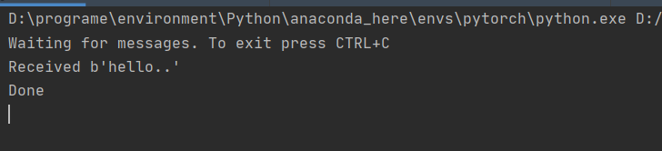

# 消费者执行耗时操作

上一个教程提到，可以将耗时的操作交给消费者执行，这样就可以快速的完成响应。在这节课中用python的`sleep`函数模拟费时操作。生成者发送消息，消息中有一个`.`，代表这个操作需要1s的执行时间。

## 程序代码

发送端发送代码:headphones:

```python
#send.py
import pika
import sys

connection = pika.BlockingConnection(pika.ConnectionParameters(host='47.94.195.238', port=5672))
channel = connection.channel()

#声明队列
channel.queue_declare(queue="hello")

# 假设命令行执行 python3 send.py hello..
# sys.argv --> ['python3','send.py','hello..']
message = ' '.join(sys.argv[1:]) or "Hello World!"
# 给队列发送消息
channel.basic_publish(exchange='',
                      routing_key='hello',
                      body=message)
print(" [x] Sent %r" % message)
```

接收端接收代码

```python
# receiver.py
import pika
import time

connection = pika.BlockingConnection(pika.ConnectionParameters(host='47.94.195.238', port=5672))
channel = connection.channel()

# 声明队列
channel.queue_declare(queue='hello')


# 收到消息处理的回调函数
def callback(ch, method, properties, body):
    print("Received %r" % body)
    time.sleep(str(body).count('.'))
    print("Done")


# 进行消息消费
channel.basic_consume(queue='hello',
                      auto_ack=True,
                      on_message_callback=callback)

print('Waiting for messages. To exit press CTRL+C')

# 开始消费 是个一直循环卡死的状态
channel.start_consuming()
```

## 运行结果

send执行脚本

```bash
python3 send.py hello..
```

接收端

