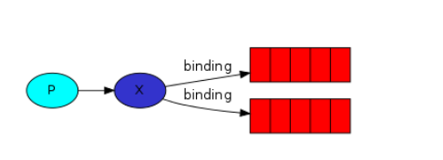
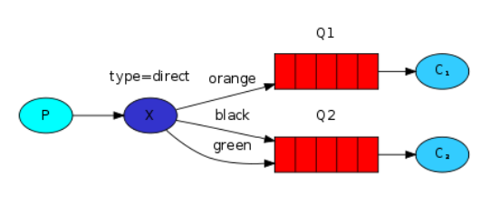

# 环境搭建

```bash
sudo apt-get install -y rabbitmq-server
```

python中和rabbitmq对接的库是`pika`

```bash
sudo apt-get install -y python-pip git-core
sudo pip3 install pika
```


需要先创建队列

在 RabbitMQ 中，消息是不能直接发送到队列，它需要发送到交换机（exchange）中，它使用一个空字符串来标识。交换机允许我们指定某条消息需要投递到哪个队列。 routing_key 参数必须指定为队列的名称


列出队列

```bash
sudo rabbitmqctl list_queues
sudo rabbitmqctl list_bindings
```


默认来说，RabbitMQ 会按顺序得把消息发送给每个消费者（consumer）。平均每个消费者都会收到同等数量得消息。这种发送消息得方式叫做——轮询（round-robin）。


有几个可供选择的交换机类型：直连交换机（direct），主题交换机（topic），头交换机（headers）和扇形交换机（fanout）。


生产者  交换机 绑定 队列

 	




## 订阅部分消息




绑定中

```bash
* 代表一个单词
# 代表任意0个或者多个单词
```


