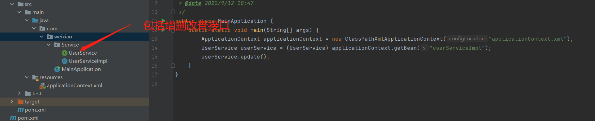
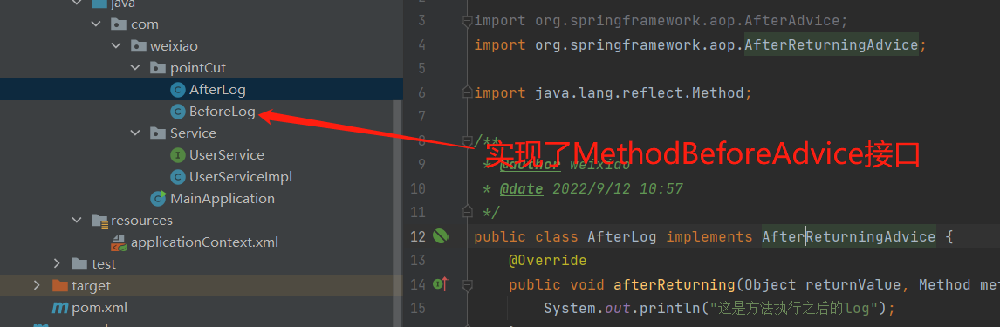

# Spring容器

Spring容器中可以创建很多个Bean，之后外界可以访问这些Bean。

```
ConfigurableApplicationContext
```

## 添加依赖

```xml
<dependency>
    <groupId>org.springframework</groupId>
    <artifactId>spring-webmvc</artifactId>
    <version>5.3.22</version>
</dependency>
```

## 简单示例

### 创建pojo

```java
public class User {
    private String name;

    public String getName() {
        return name;
    }

    public void setName(String name) {
        this.name = name;
    }

    @Override
    public String toString() {
        return "User{" +
                "name='" + name + '\'' +
                '}';
    }
}
```

### 创建beans.xml

```xml
<?xml version="1.0" encoding="UTF-8"?>
<beans xmlns="http://www.springframework.org/schema/beans"
       xmlns:xsi="http://www.w3.org/2001/XMLSchema-instance"
       xsi:schemaLocation="http://www.springframework.org/schema/beans
        https://www.springframework.org/schema/beans/spring-beans.xsd">

    <bean id="user" class="com.weixiao.pojo.User">
        <property name="name" value="hello world"/>
    </bean>

</beans>
```

### 访问bean

`ClassPathXmlApplicationContext`可以用通过多态的方式用`ApplicationContext`声明，是因为继承于`AbstractApplicationContext`，而`AbstractApplicationContext`实现了`ConfigurableApplicationContext`接口，该接口继承于``ApplicationContext``

```java
public class MainApplication {
    public static void main(String[] args) {
        ApplicationContext context = new ClassPathXmlApplicationContext("beans.xml");
        User user = (User) context.getBean("user");
        System.out.println(user);
    }
}
```

## 复杂对象访问

### 创建pojo

```java
public class Boy {
    private String name;
    private int age;
    private List<String> hobbys;
    private boolean married;
    private Map<String, String> type = new HashMap<>();

    public String getName() {
        return name;
    }

    public void setName(String name) {
        this.name = name;
    }

    public int getAge() {
        return age;
    }

    public void setAge(int age) {
        this.age = age;
    }

    public List<String> getHobbys() {
        return hobbys;
    }

    public void setHobbys(List<String> hobbys) {
        this.hobbys = hobbys;
    }

    public boolean isMarried() {
        return married;
    }

    public void setMarried(boolean married) {
        this.married = married;
    }

    public Map<String, String> getType() {
        return type;
    }

    public void setType(Map<String, String> type) {
        this.type = type;
    }

    @Override
    public String toString() {
        return "Boys{" +
                "name='" + name + '\'' +
                ", age=" + age +
                ", hobbys=" + hobbys +
                ", married=" + married +
                ", type=" + type +
                '}';
    }
}
```

### 创建beans.xml

```xml
<bean id="boy" class="com.weixiao.pojo.Boy">
    <property name="name" value="test"/>
    <property name="age" value="18"/>
    <property name="hobbys">
        <list>
            <value>22</value>
            <value>hello</value>
        </list>
    </property>
    <property name="married" value="false"/>
    <property name="type">
        <map>
            <entry key="hello" value="world"/>
            <entry key="hhh" value="test"/>
        </map>
    </property>
</bean>
```

### 访问bean

```java
ApplicationContext context = new ClassPathXmlApplicationContext("beans.xml");
Boy boy = (Boy) context.getBean("boy");
System.out.println(boy);
```

## 引用其他bean注入

其中name是属性的名字，而xxx则是另一个存在的实例bean

```xml
<bean id="boy" class="com.weixiao.pojo.Boy">
    <property name="name" ref="xxxx"/>
</bean>
```


## bean的初始化

在第一次调用`new ClassPathXmlApplicationContext("beans.xml");`时，xml中对应的所有bean会完成初始化。

## 命名空间

命名空间的使用，可以简化`bean`的声明。

### p:namespace

`p`标签用于简化**属性**的声明，首先需要进行声明。`xmlns:p="http://www.springframework.org/schema/p"`是p标签对应的声明。

```xml
<beans xmlns="http://www.springframework.org/schema/beans"
    xmlns:xsi="http://www.w3.org/2001/XMLSchema-instance"
    xmlns:p="http://www.springframework.org/schema/p"
    xsi:schemaLocation="http://www.springframework.org/schema/beans
        https://www.springframework.org/schema/beans/spring-beans.xsd">
	<!--  上下两种方式声明等效 -->
    <bean name="classic" class="com.example.ExampleBean">
        <property name="email" value="someone@somewhere.com"/>
    </bean>

    <bean name="p-namespace" class="com.example.ExampleBean"
        p:email="someone@somewhere.com"/>
</beans>
```

### c:namespce

`c`标签用于简化**构造器**，使用与`p`标签相同，也是先声明，之后再使用。

```xml
<beans xmlns="http://www.springframework.org/schema/beans"
    xmlns:xsi="http://www.w3.org/2001/XMLSchema-instance"
    xmlns:c="http://www.springframework.org/schema/c"
    xsi:schemaLocation="http://www.springframework.org/schema/beans
        https://www.springframework.org/schema/beans/spring-beans.xsd">

    <bean id="beanTwo" class="x.y.ThingTwo"/>
    <bean id="beanThree" class="x.y.ThingThree"/>

    <!-- traditional declaration with optional argument names -->
    <bean id="beanOne" class="x.y.ThingOne">
        <constructor-arg name="thingTwo" ref="beanTwo"/>
        <constructor-arg name="thingThree" ref="beanThree"/>
        <constructor-arg name="email" value="something@somewhere.com"/>
    </bean>

    <!-- c-namespace declaration with argument names -->
    <bean id="beanOne" class="x.y.ThingOne" c:thingTwo-ref="beanTwo"
        c:thingThree-ref="beanThree" c:email="something@somewhere.com"/>

</beans>
```

>两种声明方式的地址基本相同，就是最后改变了一下，一个是`c`，另一个是`p`

## bean的作用域

bean的作用域主要有两种，用`scope`关键字来进行声明，`singleton`是**默认行为**，代表单列类；`prototype`是原型模式，就和普通的创建对象一样，每次使用会`new`出来不同的对象。

```xml
<bean id="user" class="com.weixiao.pojo.User" scope="prototype">
    <property name="name" value="hello world"/>
</bean>
```

## bean的自动装配

### xml中自动装配

在xml中通过隐式的方式来完成装配，上面的都是显示装配。就是生成bean时在所有的bean中自动寻找配置。**一般声明了对象可以自动装配，如果是基本的数据类型，一般需要自己进行声明。**

#### byName

通过Name来完成配置，例如声明了一次Cat对象和Dog对象，一个人有一只猫和一只狗，再声明autowire之后，人就会自动绑定对象。绑定的机制是根据方法中的`setXXX`中的`XXX`

```xml
<bean id="user" class="com.weixiao.pojo.User" autowire="byName">
    <property name="name" value="hello world"/>
</bean>
```

#### byType

也是用于自动绑定，但是用于识别的是类型，当例如所有的bean中只有一个Dog的实例，就会将这个Dog的实例赋予人。

```xml
<bean id="user" class="com.weixiao.pojo.User" autowire="byName">
    <property name="name" value="hello world"/>
</bean>
```

### 通过注解自动装配

再给类名或者属性添加注解之后，就相当于在bean的xml中声明了对应的bean和属性。

#### 导入注解配置

```xml
<?xml version="1.0" encoding="UTF-8"?>
<beans xmlns="http://www.springframework.org/schema/beans"
       xmlns:xsi="http://www.w3.org/2001/XMLSchema-instance"
       xmlns:context="http://www.springframework.org/schema/context"
       xsi:schemaLocation="http://www.springframework.org/schema/beans
        https://www.springframework.org/schema/beans/spring-beans.xsd
        http://www.springframework.org/schema/context
        https://www.springframework.org/schema/context/spring-context.xsd">
    <!--    这行加上面的完成了配置的导入-->
    <context:annotation-config/>
</beans>
```

#### @Autowired

一般作用在属性之上，之后这些属性会自动的和bean进行绑定，value是标记这个属性是否可以为空，自动装配的逻辑是先根据byName进行自动装配。如果没有匹配到就会报错，但是可以通过`Qualifier`注解来指明具体应该绑定那个bean。

#### @component

**首先要在xml中声明扫描的具体包。**

```xml
<context:component-scan base-package="com.weixiao"/>
```

用这个注解标记类，代表将这个类注册到bean中，与在xml中注册是等效的。在不同的层，可能有不同的实现，Dao层使用`@Repository`，Controller层使用`@Controller`,Service层使用`@Service`,三者的作用和在xml文件中声明bean差不多，如果想指定某一个属性的值，需要使用`@Value(xxx)`来进行设置。

以下是一个Bean的声明，以下两种代码的声明等价。

```java
@Component
public class User {
    @Value("hello")
    private String name;  //省略部分内部代码
}
```

```xml
<bean class="com.weixiao.pojo.User">
    <property name="name" value="hello"/>
</bean>
```

### 通过类来完成装配

纯用代码来完成配置，不用声明xml文件。

以下两种配置等价，使用了`@Configuration`和`@Bean`注解。

```java
@Configuration
public class AppConfig {

    @Bean
    public MyService myService() {
        return new MyServiceImpl();
    }
}
```

```xml
<beans>
    <bean id="myService" class="com.acme.services.MyServiceImpl"/>
</beans>
```

申请访问定义的Bean。

```java
public static void main(String[] args) {
    // 注意使用了别的类 之前为：ClassPathXmlApplicationContext
    ApplicationContext ctx = new AnnotationConfigApplicationContext(AppConfig.class);
    MyService myService = ctx.getBean(MyService.class);
    myService.doStuff();
}
```

## AOP

### 代理模式

代理模式就是将这个类本该做的事情交给一个代理类实现，客户只用和这个代理类交互。

#### 静态代理

房屋中介：中介和房主都可以卖房，而客户需要买房，可以直接从中介手中购买，不用和房主打交道。

其中卖房子可以认为是一个接口，中介和房主这两个类都实现了这个接口，客户买房时，直接和中介打交道，中介对房主完成了一个代理操作。**中介类中有房主对象，可以通过房主对象访问房主的方法。**

例如代码开发完成之后，想要增加一个打日志的功能，可以开发一个新的类作为之前功能的代理，实现相同接口，既可以调用之前的方法，还可以增加新的逻辑，这样的好处是不用改变原来的代码，可以添加新的功能，像是横切了一个功能出来，这就是面向切面编程。

代码如下:

```java
// 共同实现的接口
public interface House {
    void sellHouse();
}
```

```java
// 房东实现
public class Host implements House{

    @Override
    public void sellHouse() {
        System.out.println("我是房东，我把房子卖了。");
    }
}
```

```java
// 中介
public class Middle implements House {
    private Host host;

    public Middle(Host host) {
        this.host = host;
    }

    @Override
    public void sellHouse() {
        System.out.println("我是中介，这里可以添加新功能。。。。");
        host.sellHouse();
    }
}
```

```java
// 客户调用
public static void main(String[] args) {
    Host host = new Host();
    Middle middle = new Middle(host);
    middle.sellHouse();
}
```

注意：一个房东需要一个中介对其进行代理，可能会创造出很多类，但是房东类可以聚焦于自己具体的业务实现，而不用管其他情况。

#### 动态代理

没有代理的具体类，通过动态的方式生成代理类。通常写出来的动态代理类可以代理一个接口，所有实现了该接口的类都可以通过这个动态代理类生成代理。

主要依靠两个类：`Proxy`和`InvocationHandler`

```java
public class DynamicProxy implements InvocationHandler {

    /**
     * 被代理的接口
     */
    private Object target;

    public void setTarget(Object target) {
        this.target = target;
    }

    /**
     * 得到代理类
     *
     * @return
     */
    public Object getProxy() {
        return Proxy.newProxyInstance(this.getClass().getClassLoader(), target.getClass().getInterfaces(),
                this);
    }

    /**
     * 具体的代理方法在这里执行
     * @param proxy
     * @param method
     * @param args
     * @return
     * @throws Throwable
     */
    @Override
    public Object invoke(Object proxy, Method method, Object[] args) throws Throwable {
        Object result = method.invoke(target, args);
        return result;
    }
}
```

```java
public static void main(String[] args) {
    // 真实角色
    House host = new Host();
    // 生成代理的类
    DynamicProxy dynamicProxy = new DynamicProxy();
    // 设置要代理的对象
    dynamicProxy.setTarget(host);
    // 获得代理对象，要用接口形式
    House proxy = (House) dynamicProxy.getProxy();
    // 调用方法
    proxy.sellHouse();
}
```

### Spring实现

AOP（Aspect Oriented Programming）面向切面编程，可以理解为每一个切面代表一个功能，当你需要添加新的功能的时候，增加一个切面，切面的实现就是在原来的基础上实现代理，这样实现不会影响原来的方法实现。

#### AOP依赖

```xml
<!-- https://mvnrepository.com/artifact/org.aspectj/aspectjweaver -->
<dependency>
    <groupId>org.aspectj</groupId>
    <artifactId>aspectjweaver</artifactId>
    <version>1.9.9.1</version>
</dependency>
```

#### AOP实现

##### 基础环境搭建

需求：现在UserService有基本的增删改查功能，想要添加一个切面完成日志的功能。



##### 使用Spring API接口

在xml文件中引入aop的相关支持。

```xml
<beans xmlns="http://www.springframework.org/schema/beans"
       xmlns:xsi="http://www.w3.org/2001/XMLSchema-instance"
       xmlns:aop="http://www.springframework.org/schema/aop"
       xsi:schemaLocation="http://www.springframework.org/schema/beans
        https://www.springframework.org/schema/beans/spring-beans.xsd
        http://www.springframework.org/schema/aop
        https://www.springframework.org/schema/aop/spring-aop.xsd
        ">
</beans>
```

声明两个类，分别实现不同的接口，表明在方法执行前后会调用这些参数。



在xml文件中完成相应的注册。**`pointcut`可以理解为要代理的类，而`advice`则可以理解为用什么进行代理。**

```xml
<bean id="userServiceImpl" class="com.weixiao.Service.UserServiceImpl"/>
<bean id="afterLog" class="com.weixiao.pointCut.AfterLog"/>
<bean id="beforeLog" class="com.weixiao.pointCut.BeforeLog"/>

<aop:config>
    <aop:pointcut id="pointcout" expression="execution(* com.weixiao.Service.UserService.*(..))"/>
    <aop:advisor advice-ref="beforeLog" pointcut-ref="pointcout"/>
    <aop:advisor advice-ref="afterLog" pointcut-ref="pointcout"/>
</aop:config>
```

>execution语法为(返回值 类型名.方法名字(参数名))，execution(* com.weixiao.Service.UserService.*(..))代表返回值任意，com.weixiao.Service.UserService类下的所有方法所有参数，都会进行代理。

##### 自定义类

随便定义一个类，没有任何要求，之后再xml文件中进行注册绑定之后，这个类才会完成代理工作。

```java
public class DiyPointCut {

    public void before(){
        System.out.println("方法执行前");
    }

    public void after(){
        System.out.println("方法执行后");
    }
}
```

在xml中进行绑定

```xml
<aop:config>
    <aop:aspect ref="diy">
        <aop:pointcut id="pointcut" expression="execution(* com.weixiao.Service.UserService.*(..))"/>
        <aop:before method="before" pointcut-ref="pointcut"/>
        <aop:after method="after" pointcut-ref="pointcut"/>
    </aop:aspect>
</aop:config>
```

##### 注解

通过注解的方式可以大大简化开发，首先要在xml中声明注解。

```xml
<aop:aspectj-autoproxy/>
```

```java
@Aspect
public class AnnotationProxy {

    @Before("execution(* com.weixiao.Service.UserService.*(..))")
    public void  before(){
        System.out.println("通过注解实现before");
    }

    @After("execution(* com.weixiao.Service.UserService.*(..))")
    public void  after(){
        System.out.println("通过注解完成after");
    }
}
```

>需要在xml中注册AnnotationProxy对应的bean

