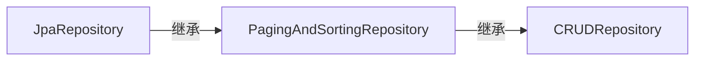

---

---

# SpringJPA

## 连接数据库

```xml
<dependency>
    <groupId>org.springframework.boot</groupId>
    <artifactId>spring-boot-starter-data-jpa</artifactId>
</dependency>
<dependency>
    <groupId>mysql</groupId>
    <artifactId>mysql-connector-java</artifactId>
    <version>8.0.30</version>
</dependency>
```

```properties
spring.datasource.url=jdbc:mysql://127.0.0.1:3306/spring_data_jpa
spring.datasource.driver-class-name=com.mysql.cj.jdbc.Driver
spring.datasource.username=root
spring.datasource.password=123456
spring.jpa.hibernate.ddl-auto=update
spring.jpa.show-sql=true
spring.jpa.properties.hiberante.dialect=org.hibernate.dialect.MySQLDialect
spring.jpa.properties.hibernate.format_sql=true
```

## 将数据映射为JAVA类

> 使用注解时，尽量使用`javax`中的注解，这样实现就不依靠hibernate框架了，以后可以更换其他框架。

如下是一个简单的`Student`类。常见的注解为`@Entity`,`@Table`,`@Column`

```java
@Entity
@Table(
        name = "student",
        uniqueConstraints = {
                @UniqueConstraint(name = "student_email_unique", columnNames = "email")
        } // 也可以在@Column中定义，但是无法指定名字
)
public class Student {

    @Id
    @SequenceGenerator(name = "student_sequenceTest",
            sequenceName = "student_sequence",
            allocationSize = 1) //  每次id的增量（默认id的初始值为1）
    @GeneratedValue(strategy = GenerationType.SEQUENCE,
            generator = "student_sequence")
    @Column(
            name = "id",
            updatable = false
    )
    private Long id;
    
    @Column(name = "first_name",
            nullable = false,
            columnDefinition = "TEXT")
    private String firstName;
    
    @Column(name = "last_name",
            nullable = false,
            columnDefinition = "TEXT")
    private String lastName;
    
    @Column(name = "email",
            nullable = false,
            columnDefinition = "TEXT"
    )
    private String email;
    
    @Column(name = "age",
            nullable = false)
    private Integer age;
}
```

## 操纵数据库

通过Repository来完成，自定义的Repository需要继承，CRUDRepository、PagingAndSortingRepository、JpaRepository，其中三者的关系如下图所示



CRUD有基本的增删改查方法，PagingAndSorting增加了分页和Sort，Jpa主要增加了flush方法（对于事务的支持比较好 ）。

### 自定义查询语句

使用`@Query`来完成查询，通过`value`属性来书写具体的查询语句，**里面的语法是JPQL，不是SQL语句**，这种语句和具体的数据库无关。如果想要使用具体的SQL语句，需要将`nativeQuery`属性设置为true。

```java
@Query(value = "SELECT s FROM Student s WHERE s.email = ?1")
void findByEmail(String email);
```


### 分页和Sort

## Entity的生命周期

### *persistence context*

所有entity实例的集合，其中的每一个数据，都代表数据库中的一条记录

### 四个生命周期

### Transient

用`new`关键字创建对象之后进入这个状态，此时*persistence context*和数据库中都没有该对象。

