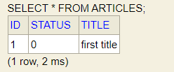
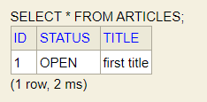
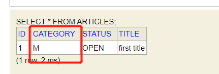

# 枚举

在数据库中，某一个属性可能需要进行枚举，例如性别可以有男和女两类，尺寸可以有大、中、小三个枚举结果，如何将java类和数据库中的表联系在一起？

## 环境搭建

在pom.xml文件中加入依赖

```xml
<!--数据库相关-->
<dependency>
    <groupId>org.springframework.boot</groupId>
    <artifactId>spring-boot-starter-data-jpa</artifactId>
</dependency>
<dependency>
    <groupId>com.h2database</groupId>
    <artifactId>h2</artifactId>
    <scope>runtime</scope>
</dependency>
<dependency>
    <groupId>org.projectlombok</groupId>
    <artifactId>lombok</artifactId>
    <optional>true</optional>
</dependency>
```

假设要在数据库中创建一张`article`表，用来记录文章,只有id和文章名字属性

```java
@Entity
@Data
@Table(name = "articles")
public class Article {
    @Id
    @GeneratedValue(strategy = GenerationType.IDENTITY)
    private Long id;

    @Column(name = "title")
    private String title;
}
```

## 使用@*Enumerated* 注解

加入`status`属性来保存文章的状态，文章的状态主要有以下三种。

| 枚举类型 | 解释     |
| -------- | -------- |
| REVIEW   | 审核中   |
| REJECTED | 被拒稿   |
| OPEN     | 已经发表 |

```java
// 代码实现
public enum Status {
    OPEN, REVIEW, REJECTED;
}
```

原来的Article类变为

```java
@Entity
@Data
@Table(name = "articles")
public class Article {
    @Id
    @GeneratedValue(strategy = GenerationType.IDENTITY)
    private Long id;

    @Column(name = "title")
    private String title;

    @Column(name = "status")
    private Status status;
}
```

实现初始化数据类

```java
@RequiredArgsConstructor
@Component
public class LoadData implements CommandLineRunner {
    private final ArticleRepository articleRepository;

    @Override
    public void run(String... args) throws Exception {
        Article article = new Article();
        article.setTitle("first title");
        article.setStatus(Status.OPEN);
        articleRepository.save(article);
    }
}
```

用jpa实现与数据库交互的类

```java
@Repository
public interface ArticleRepository extends CrudRepository<Article,Long> {
    Article save(Article article);
}
```

通过`localhost:8080/h2-database`可以访问h2数据库。

查询后发现保存的对象为



**可以看到STATUS保存的是对应的ID，这是因为默认相当于给`Status`属性添加了`@Enumerated(EnumType.ORDINAL)`**`EnumType.ORDINAL`是默认值，也可以不写。

**弊端**：当改变Enum类型时，往中间插入一个新数据的时候，索引的对应关系就全乱了，如果已经有很多数据，去更新数据是很不现实。

## 使用EnumType.STRING

顾名思义，这个注解将用字符串的形式来保存对应的数据。进行如下修改

```java
@Column(name = "status")
@Enumerated(EnumType.STRING)
private Status status;
```



弊端：虽然可以应对修改，但是相比于存储整数，这种存储方式更加消耗空间。

## *@Converter* Annotation

>该注解在JPA2.1之后才引入

因为字符串保存在数据库中会浪费很多空间，同时为了保证程序的可读性，很自然我们可以想到，我们可以将数值保存到数据库中，当Java程序去读取数据时，再将数据转化为枚举类型，所以我们要在二者之间添加一个`Converter (转换器)`

转换器的实现需要创建一个类实现*javax.persistence.AttributeConverter*接口

创建一个`Category`类，后面的值是添加到数据库中的值。

```java
public enum Category {
    SPORT("S"), MUSIC("M"), TECHNOLOGY("T");

    private String code;

    private Category(String code) {
        this.code = code;
    }

    public String getCode() {
        return code;
    }
}
```

在Article中添加该属性

```java
@Column(name = "category")
private Category category;
```

实现*javax.persistence.AttributeConverter*

```java
@Converter(autoApply = true)
public class CategoryConverter implements AttributeConverter<Category, String> {

    @Override
    public String convertToDatabaseColumn(Category category) {
        if (category == null) {
            return null;
        }
        return category.getCode();
    }

    @Override
    public Category convertToEntityAttribute(String code) {
        if (code == null) {
            return null;
        }

        return Stream.of(Category.values())
                .filter(c -> c.getCode().equals(code))
                .findFirst()
                .orElseThrow(IllegalArgumentException::new);
    }
}
```

`@Converter(autoApply = true)`在数据库保存对应的枚举类型时候，会自动应用该converter

```java
article.setCategory(Category.MUSIC); //设置Category
```

数据库中查看结果



如果并非相对所有的Category保存到数据库时都应用`CategoryConverter`，可以首先修改`@Converter(autoApply = true)`为`@Converter`，之后再想要应用`CategoryConverter`的属性上添加`Convert`注解

```java
 @Column(name = "category")
 @Convert(converter = CategoryConverter.class)
 private Category category;
```

## 总结

本文主要讲解了如何完成java代码中Enum和数据库表中字段映射，默认的策略是保存索引，但是这种情况下，当有新的数据插入的时候，就会导致需要更新大量数据；可以改用保存字符串的策略，虽然可以应对未来的修改，但是保存字符串会消耗更多的空间；为了兼顾这两点，JPA2.1引入了转换器，通过某个类实现*javax.persistence.AttributeConverter*接口并使用@Converter注解可以实现数据库字段的报错和提取自定义。