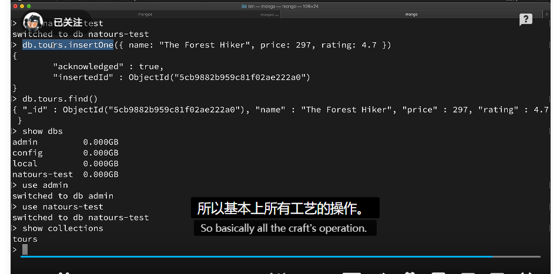
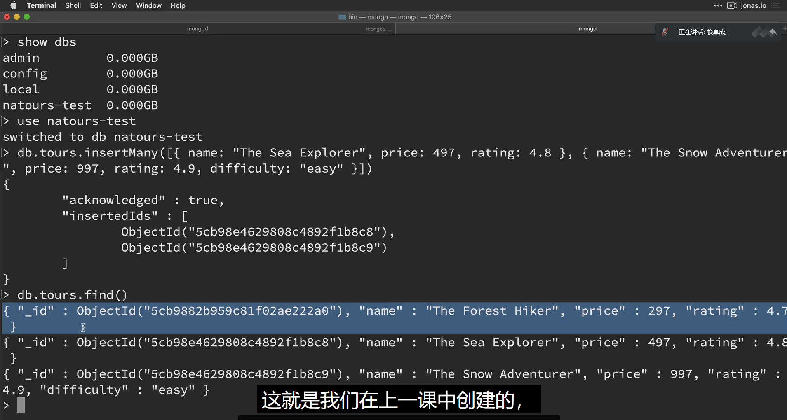
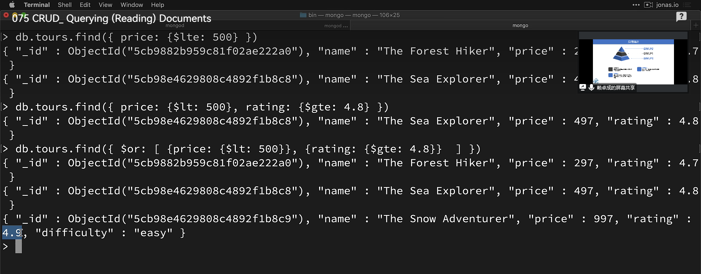

# module

每一个文件都可以被看做一个module

## 导出

```js
//replaceTemplate.js
module.exports = (temp, product) => {
    // do something
    return output;
}
```

## 导入

```js
// 不用使用.js后缀
// 返回名字可以任意命名
const replaceTemplate = require('./module/replaceTemplate');
```

