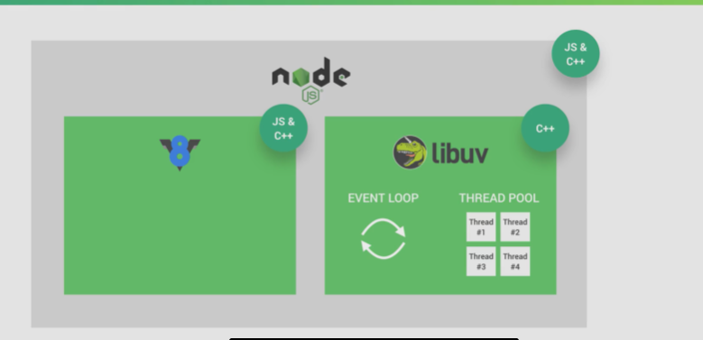

# Nodejs

nodejs是基于google开发的V8引擎开发的js运行环境。

html、css和js可以在浏览器中执行这一点是毋庸置疑的，而nodejs的作用就是可以让js在浏览器之外运行，而nodejs中真正起作用让执行js的是google的V8引擎，所以说，nodejs是建立在V8引擎之上的js运行环境。

一些库的用法可以参见：[官方文档](https://nodejs.org/docs/latest-v16.x/api/fs.html)

## node结构



node是基于js和C++写的，除了V8引擎之外，libuv也是一个重要组成部分，还有一些其他一些库，libuv的两个功能是事件循环和线程池，事件循环可以处理回调，线程池当node主线程有巨大的耗费资源的操作时，将会调用线程池执行，线程池的数目可以进行配置。

## 使用

nodejs为js提供了在浏览器环境外的运行环境，可以完成一些在浏览器中无法完成的事情，例如读取写入文件等。

```bash
node index.js # 运行index.js
```

## Asynchronous和synchronous（同步和异步）

synchronous将会一条一条命令执行，是一种阻塞结构；asynchronous是一种异步执行机制，将耗时操作放在后台执行，当执行完之后，再调用对应的回调函数。

>**nodejs是单线程的**

最开始使用callback，当耗时函数执行完之后执行对应的回调函数，但多个回调连续调用将会导致回调地狱。

ES6引入了Promise

ES8引入了 async和await关键字