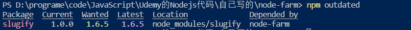
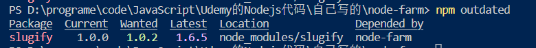

# npm

npm是一个包管理器，可以管理一个项目依赖的包。

## 创建npm项目

```bash
npm init
```

创建之后会在当前目录下生产`package.json`,安装依赖之后会生成`node_modules`文件。

## 本地依赖和开发依赖

本地依赖：该项目运行时需要的依赖，例如express

默认安装是本地安装

```bash
npm i slugify # 本地安装slugify这个包

// 使用
const slugify = require('slugify')
```

开发依赖：只有在开发阶段使用的依赖，例如nodemon、webpack等

nodemon可以在文件改变时候自动重启node服务器。

```bash
npm i nodomon --save-dev # 以开发依赖进行安装
```

## 全局安装和本地安装

默认情况下，运行npm之后都是本地安装，安装的依赖只有当前项目可以使用，但是有一些包，一般是基于命令行使用的包，所有项目都要使用，可以将其安装为全局依赖，这样所有项目不用安装那个依赖也可以进行使用。

```bash
npm i nodemon --global
```

之后全局可以使用`nodemon index.js`运行nodemon，**默认在命令行中会执行全局依赖对应的命令，**上一步我们在本地项目中也安装了nodemon，如何使用本地的nodemon而不使用全局的nodemon？需要修改`package.json`文件中的"script"标签

```json
"scripts": {
    "start": "nodemon index.js"
},
```

本地nodemon运行命令

```bash
npm run start
npm start # 简写
```

## 版本

```json
"devDependencies": {
    "nodemon": "^2.0.20"
}
```

| 名词   | 解释                                                         |
| ------ | ------------------------------------------------------------ |
| 2.0.20 | major version. minor version. patch version 主版本.次版本.补丁版本 |
| ^      | 更新次版本和补丁版本                                         |
| ~      | 只更新补丁版本（相对更安全，有可能次版本引入了bug但是还未被发现） |
| *      | 更新到最新的包，主版本也会更新，有些不安全                   |

* 主版本：有大的变动的时候改变主版本号
* 次版本：引入新的功能改变次版本，**新版本可以向下兼容** ，原来代码依然可以运行
* 补丁版本：只修复bug，不引入新功能

```bash
# 卸载slugify
npm uninstall slugify
# 安装指定版本的slugify
npm install slugify@1.0.0
```

查看已经过时的包,使用`npm outdated`

` "slugify": "^1.0.0"`对应



` "slugify": "~1.0.0"`对应



更新包可以使用`npm update`

该命令之后，可以在`package-lock.json`中查看具体的版本，`package.json`未发生更新。

>`package-lock.json`指定了所有的依赖版本，包括所安装依赖依赖的其他模块的版本。

## node_modules

`node_modules`文件夹存放了所有的依赖，可以删除改文件夹之后通过`npm isntall`获取该文件夹。

