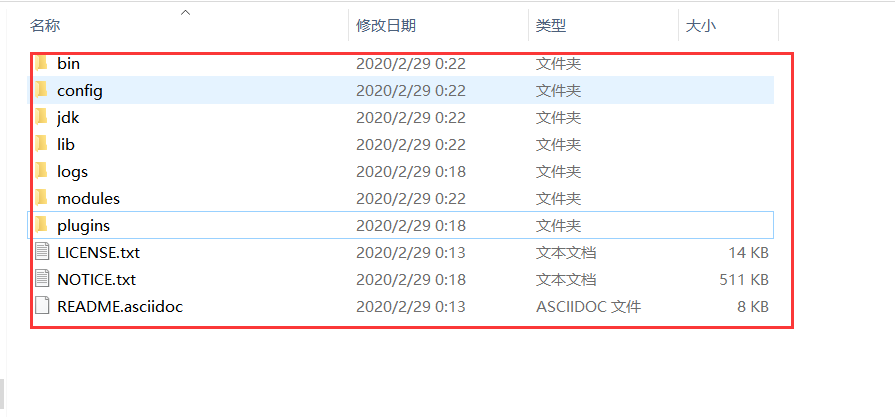
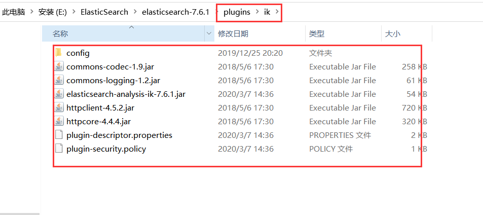
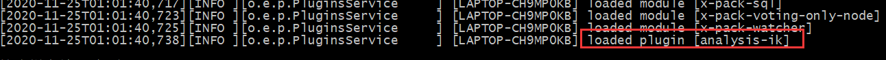
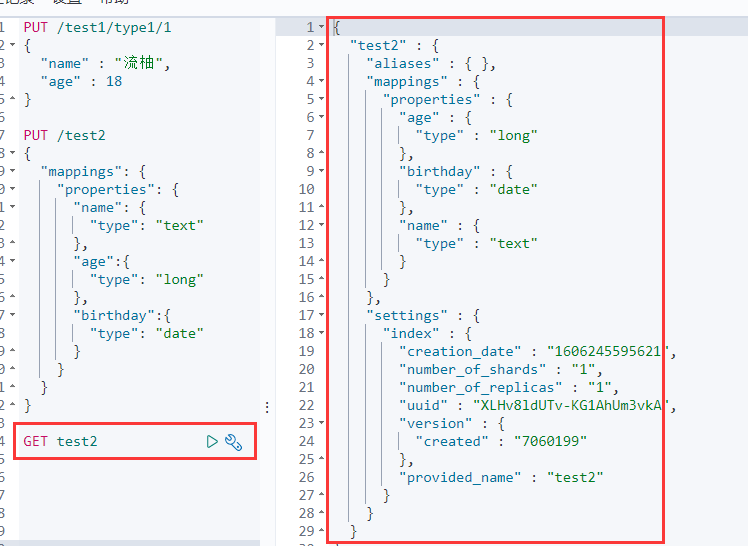
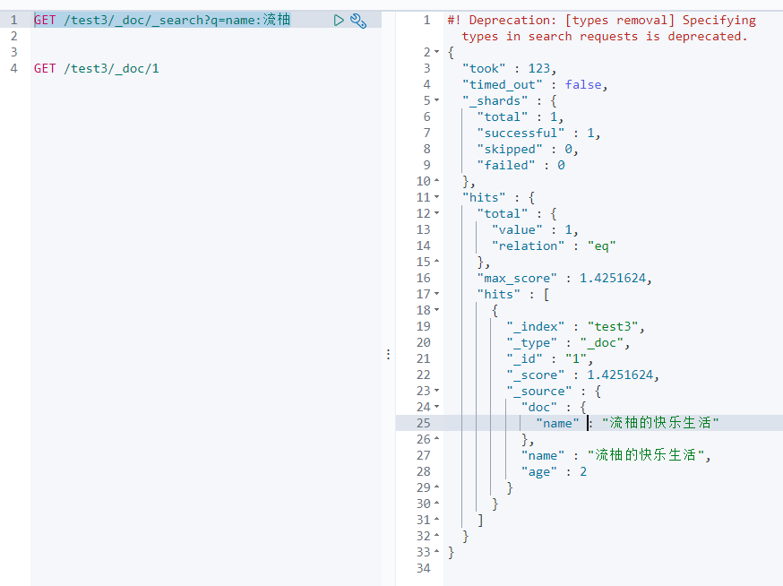

# ElasticSearch

> 笔记记录来源 B站狂神说Java的ElasticSearch课程：https://www.bilibili.com/video/BV17a4y1x7zq

## 背景知识

`ElasticSearch`是对`Lucene`进行了封装和增强，`Lucene`是apache软件基金会下的一个子项目，是一个全文搜索引擎工具包。

**Elaticsearch**，简称为es，es是一个开源的**高扩展**的**分布式全文检索引擎**，它可以近乎**实时的存储**、**检索数据;**本身扩展性很好，可以扩展到上百台服务器，处理PB级别(大数据时代）的数据。es也使用java开发并使用Lucene作为其核心来实现所有索引和搜索的功能，但是它的**目的**是<mark>通过简单的**RESTful API**来隐藏Lucene的复杂性，从而让全文搜索变得简单</mark>。

## :cactus:ES和Solr

### 相同之处

* 二者都是在Lucene上进行二次开发
* 可以通过http请求来进行操作

### 不同之处

* solr支持多种数据格式，es只支持Json

### 性能对比

1. 当单纯的对已有数据进行搜索时，Solr更快
2. 当实时建立索引时，Solr会产生io阻塞，查询性能较差，ElasticSearch具有明显的优势
3. 随着数据量的增加，Solr的搜索效率会变得更低，而ElasticSearch却没有明显的变化

## 安装配置

>es开箱即用，下载下来之后解压就能用，es版本变更很快，**注意查看官方网文档**

解压后的目录如下：



相关的目录作用如下

```
bin 启动文件目录
config 配置文件目录
    1og4j2 日志配置文件
    jvm.options java 虚拟机相关的配置(默认启动占1g内存，内容不够需要自己调整)
    elasticsearch.ym1 elasticsearch 的配置文件! 默认9200端口!跨域!
1ib 
    相关jar包
modules 功能模块目录
plugins 插件目录
    ik分词器
```

去bin目录下寻找`elasticsearch.bat`文件双击即可启动。

**开启跨域（在elasticsearch解压目录config下elasticsearch.yml中添加）**

```bash
# 开启跨域
http.cors.enabled: true
# 所有人访问
http.cors.allow-origin: "*"
```

每次更新完成之后记得重启

>`Kibana`是官方开发的一个针对ElasticSearch的开源分析及可视化平台,用来与Es进行交互。

## 重要概念

| 名词            | 类比数据库             |
| --------------- | ---------------------- |
| 索引            | 数据库                 |
| 类型(types)     | 表                     |
| 文档(documents) | 表中的一行（一条数据） |
| fields          | 数据表中的一列         |

>**类型**规定了如何对数据进行存储，不过最新版本已经对类型弃用了，有点像非关系型数据库了。

elastic默认是采用集群设计的，即使是一台机器上运行，也是单集群。

**elastic索引进行分片，分片是一个包含倒排索引的文件目录，倒排索引的结构使得elasticsearch在不扫描全部文档的情况下，就能告诉你哪些文档包含特定的关键字**

>**倒排索引**：简单说就是 按（文章关键字，对应的文档\<0个或多个\>）形式建立索引，根据关键字就可直接查询对应的文档（含关键字的），无需查询每一个文档，如下图


## 插件

### ik分词器

#### 安装

默认es不能对中文进行处理，如果想要给es提供额外的功能 ，可以在plugins目录下安装插件，想支持中文处理可以安装`ik分词器`。

下载地址：https://github.com/medcl/elasticsearch-analysis-ik/releases

下载完成之后解压缩到plugins目录下，重新启动es，在日志中可以看到加载了对应的插件。





#### 算法展示 

**IK提供了两个分词算法**: `ik_smart`和`ik_max_word` ,其中`ik_smart`为**最少切分**, `ik_max_word`为**最细粒度划分**!


#### 自定义分词 

虽然上面的结果进行了分词，但是有时候并不能和我们的想法一致


这种情况下，我们可以自定义分词，自己添加字典

配置目录 ：elasticsearch目录/plugins/ik/config/IKAnalyzer.cfg.xml


要在对应的目录下建立`my.dic`


### 查看插件

要在安装目录的bin目录下运行对应对的命令

```bash
# 查看对应插件
elasticsearch-plugin list
```

# Rest风格操作Es

### 方法总览

|      method      |                     url地址                     |          描述          |
| :--------------: | :---------------------------------------------: | :--------------------: |
| PUT（创建,修改） |     localhost:9200/索引名称/类型名称/文档id     | 创建文档（指定文档id） |
|   POST（创建）   |        localhost:9200/索引名称/类型名称         | 创建文档（随机文档id） |
|   POST（修改）   | localhost:9200/索引名称/类型名称/文档id/_update |        修改文档        |
|  DELETE（删除）  |     localhost:9200/索引名称/类型名称/文档id     |        删除文档        |
|   GET（查询）    |     localhost:9200/索引名称/类型名称/文档id     |   查询文档通过文档ID   |
|   POST（查询）   | localhost:9200/索引名称/类型名称/文档id/_search |      查询所有数据      |

### 测试:tea:

#### 创建一个文档

```bash
PUT /test1/type1/1
{
  "name" : "流柚",
  "age" : 18
}
```


#### 数据类型

- 字符串类型

  - text、

    keyword

    - text：**支持分词**，全文检索,支持模糊、精确查询,不支持聚合,排序操作;te**xt类型的最大支持的字符长度无限制,适合大字段存储；**
    - keyword：**不进行分词**，直接索引、支持模糊、支持精确匹配，支持聚合、排序操作。keyword类型的最大支持的长度为——32766个UTF-8类型的字符,可以通过设置ignore_above指定自持字符长度，超过给定长度后的数据将不被索引，无法通过term精确匹配检索返回结果。

- 数值型

  - long、Integer、short、byte、double、float、**half float**、**scaled float**

- 日期类型

  - date

- te布尔类型

  - boolean

- 二进制类型

  - binary

- 等等…

#### 建立类型

>可以看做指定document存放时的规则


#### 获取规则



#### 默认规则

> `_doc` 默认类型（default type），type 在未来的版本中会逐渐弃用，因此产生一个默认类型进行代替

以下示例中创建了一条数据，相应的类型被自动指定。


#### 获取ES信息

```bash
GET _cat/indices
GET _cat/aliases
GET _cat/allocation
GET _cat/count
GET _cat/fielddata
GET _cat/health
GET _cat/indices
GET _cat/master
GET _cat/nodeattrs
GET _cat/nodes
GET _cat/pending_tasks
GET _cat/plugins
GET _cat/recovery
GET _cat/repositories
GET _cat/segments
GET _cat/shards
GET _cat/snapshots
GET _cat/tasks
GET _cat/templates
GET _cat/thread_pool
```

#### 更新document

##### put方法覆盖

>1. 版本会+1
>2. 如果漏掉某个字段没有写，**相应对的字段将会丢失**


##### post进行更新

>1. version也会+1
>2. 字段不会丢失，只会更新对应的


#### 删除document


#### 查询（重点，搜索就是通过这个完成的）

查询name包含流柚的document，注意返回的是hit，之后可以通过java获取这个对象



#### 复杂查询

索引中的内容


##### ①查询匹配

- `match`：匹配（会使用分词器解析（先分析文档，然后进行查询））
- `_source`：过滤字段，结果中只包含某些字段
- `sort`：排序
- `form`、`size` ：分页查询参数


##### ②多条件查询（bool）

- `must` 相当于 `and`
- `should` 相当于 `or`
- `must_not` 相当于 `not (... and ...)`，几个条件同时不满足
- `filter` 过滤，对结果进行限制


##### ③匹配数组

- 可以多关键字查（空格隔开）— 匹配字段也是符合的
- `match` 会使用分词器解析（先分析文档，然后进行查询）


##### ④精确查询

- `term` 直接通过 倒排索引 指定**词条**查询
- 适合查询 number、date、keyword ，不适合text


>注意上面的年后面有空格

##### ⑤text和keyword

- text：
  - **支持分词**，**全文检索**、支持模糊、精确查询,不支持聚合,排序操作;
  - text类型的最大支持的字符长度无限制,适合大字段存储；
- keyword：
  - **不进行分词**，**直接索引**、支持模糊、支持精确匹配，支持聚合、排序操作。
  - keyword类型的最大支持的长度为——32766个UTF-8类型的字符,可以通过设置ignore_above指定自持字符长度，超过给定长度后的数据将不被索引，**无法通过term精确匹配检索返回结果**。

>todo: 也就是说keyword完全匹配才可以进行返回

##### ⑥高亮查询

