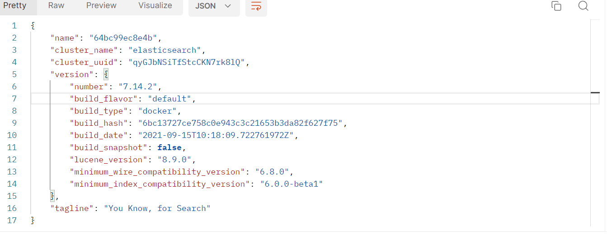

# Docker配置

## docker-compose

更改文件权限

**chmod -R 777 elasticsearch路径**

```yaml
version: "3.3"
services:
    elasticsearch:
        container_name: "cz-elasticsearch"
        image: "elasticsearch:7.14.2"
        ports:
            - "5005:9200"
            - "5006:9300"
        volumes:
            - ./config/elasticsearch.yml:/usr/share/elasticsearch/config/elasticsearch.yml
            - ./plugins:/usr/share/elasticsearch/plugins
            - ./data:/usr/share/elasticsearch/data
        environment:
            discovery.type: "single-node"
            ES_JAVA_OPTS: "-Xms64m -Xmx128m"
```

文件目录如下：

-config

​	- elasticsearch.yml

-data

-docker-compose.yml

-plugins

**elasticsearch.yml文件内容：**

```yaml
http.host: 0.0.0.0
http.cors.enabled: true
http.cors.allow-origin: "*"
```


运行`docker-compose up -d`

## 测试

访问`http://服务器地址:es端口`，如果看到类似如下的响应，代表Es已经安装完成



## 安装分词器

目前安装好之后是不支持中文的，需要安装中文的分词器

首先进入容器中`docker exec -it elasticsearch /bin/bash`

安装分词器:`./bin/elasticsearch-plugin install https://github.com/medcl/elasticsearch-analysis-ik/releases/download/v7.14.2/elasticsearch-analysis-ik-7.14.2.zip`

重启容器:`docker restart elasticsearch`

测试，访问`http://服务器IP地址:es端口/_analyze`（使用post请求）

请求体

```json
{
	"tokenizer":"ik_smart",
	"text":"我爱技术"
}
```

返回

```json
{
    "tokens": [
        {
            "token": "我",
            "start_offset": 0,
            "end_offset": 1,
            "type": "CN_CHAR",
            "position": 0
        },
        {
            "token": "爱",
            "start_offset": 1,
            "end_offset": 2,
            "type": "CN_CHAR",
            "position": 1
        },
        {
            "token": "技术",
            "start_offset": 2,
            "end_offset": 4,
            "type": "CN_WORD",
            "position": 2
        }
    ]
}
```

报错修复：

如果报错：

```js
{
  "error" : {
    "root_cause" : [
      {
        "type" : "null_pointer_exception",
        "reason" : "Cannot invoke \"org.wltea.analyzer.dic.DictSegment.match(char[], int, int)\" because \"org.wltea.analyzer.dic.Dictionary.singleton._StopWords\" is null"
      }
    ],
    "type" : "null_pointer_exception",
    "reason" : "Cannot invoke \"org.wltea.analyzer.dic.DictSegment.match(char[], int, int)\" because \"org.wltea.analyzer.dic.Dictionary.singleton._StopWords\" is null"
  },
  "status" : 500
}
```

说明插件的安装目录下没有config文件夹（也就是plugins目录），去GitHub上下载一个之后放到对应的位置后重启即可。