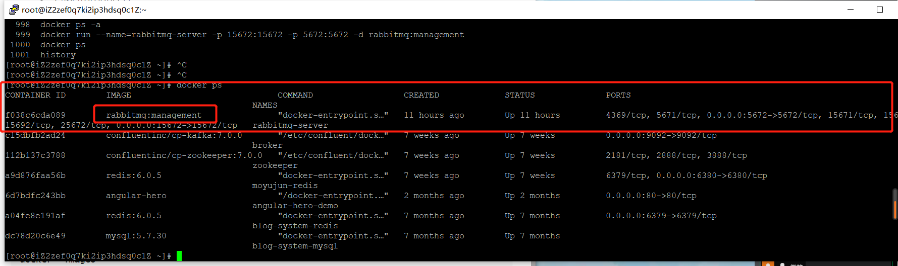
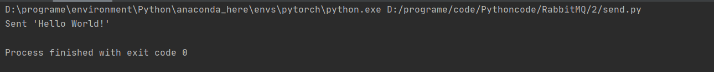
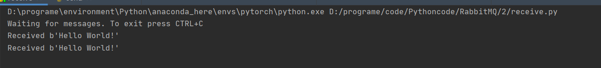

# rabbitmq

## 什么是rabbitmq

一个消息处理的中间件，里面最重要的有三个概念:jack_o_lantern:

* 生成者(producer)：可以产生消息，并发送到队列中
* 队列(queue)：用于保存消息
* 消费者(consumer)：对消息进行处理（或者叫消费）

通常的流程是生产者生成一条消息，发送到队列中，然后消费者从这个队列中，获取这条消息，进行对应的操作。这样的好处是可以减少响应的时间，例如发送一个http请求，有一个需要耗费10s的操作，当然不可能等到这个操作完成之后再返回结果，所以可以先在这里部署一个生产者，发送一条消息到队列汇总，之后直接返回，发送队列中消耗的时间很短，此时消费者就可以根据发送到队列中的消息进行操作，既可以让保证操作的完成，也可以快速返回数据。(当然也可能存在消息丢失等情况，不过那都是后话了，以后再讨论)

## rabbitmq运行

>本教程rabbitmq的运行是基于docker的容器技术，需要提前有docker的环境

首先下载rabbitmq的镜像，这里选择`rabbitmq:management`，management会有管理的客户端，rabbitmq没有可视化的管理客户端。

```bash
# 拉取镜像
docker pull rabbitmq:management
# 查看image
docker  images
# 运行镜像 15672是管理中心的端口 5672是rabbitmq的端口
docker run --name=rabbitmq-server -p 15672:15672 -p 5672:5672 -d rabbitmq:management
# 查看正在运行的容器
docker ps
```



## 简单示例

目标：生产者发送一条消息到队列中，消费者从队列中取出消息进行消费。

>消息：其实就是一个字符串
>
>可以将简单的理解为，生产者将字符串存放到队列中，之后消费者从队列中将这个字符串取出进行响应

这里使用`pika`作为和`rabbitmq`交互的第三方库:haircut:

```bash
# 安装pika
pip install pika
```

**host要替换成对应的主机，如果是本机，应为"127.0.0.1"**:dancers:

用于发送的程序：

```python
# send.py
import pika

#声明连接 建立通道
connection = pika.BlockingConnection(pika.ConnectionParameters(host='xxxx', port=5672))
channel = connection.channel()

# 声明一个队列，在send和receive程序中都要声明
# 如果没有这个队列，就创建，有的话不会有任何影响
# 向不存在的队列中发送消息消息会被丢弃
channel.queue_declare(queue='hello')

# 向队列中发送消息，内容为Hello World!
channel.basic_publish(exchange='',
                      routing_key='hello',
                      body='Hello World!')
print("Sent 'Hello World!'")

# 关闭连接
connection.close()
```

用于接收的程序：

```python
# receive.py
import pika

# 声明连接 建立通道
connection = pika.BlockingConnection(pika.ConnectionParameters(
    host='xxxx', port=5672))
channel = connection.channel()

# 声明队列
channel.queue_declare(queue='hello')


# 定义回调函数  这个函数决定了收到消息之后消费者会如何响应
# body 对应刚刚发送的字符串 Hello World
def callback(ch, method, properties, body):
    print("Received %r" % body)


# 消费事件
channel.basic_consume(queue='hello',
                      auto_ack=True,
                      on_message_callback=callback)

print('Waiting for messages. To exit press CTRL+C')

# 开始消费 -- 会持续运行
channel.start_consuming()
```

## 运行结果

多次运行send.py(2次)



接收端结果

