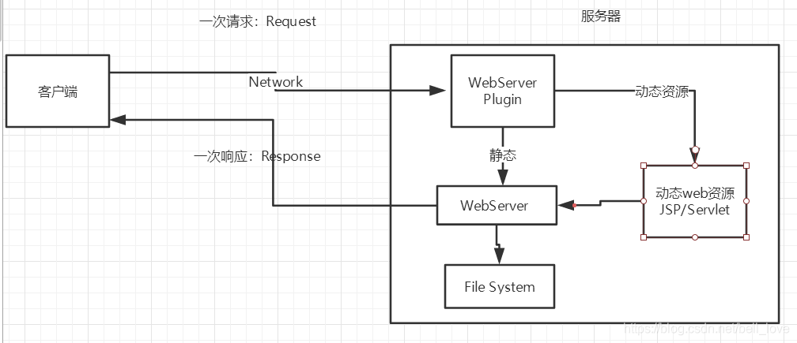
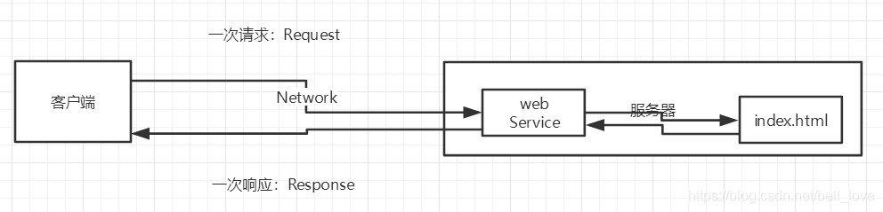

# WEB基础知识

## 动态WEB

不通的用户可以接收到不同的内容，现在大多数WEB都是基于这种方式实现的。

## 静态WEB

静态资源，通过url直接访问返回结果。

web服务器

## 技术讲解

### ASP

* 微软：国内最早流行的就是ASP；
* 在HTML中嵌入了VB的脚本，ASP+COM；
* 在ASP开发中，基本一个页面都有几干行的业务代码，页面极其换乱
* 维护成本高！

### php

* PHP开发速度很快，功能很强大，跨平台，代码很简单（70%，WP）
* **无法承载大访问量的情况**（局限性）

### JSP/Servlet

B/S；浏览器和服务器

C/S：客户端和服务器

* sun公司主推的B/S架构

* 基于Java语言的（所有的大公司，或者一些开源的组件，都是用Java写的）
* 可以承载三高问题带来的影响，高并发、高性能、高可用；
* 语法像ASP，ASP->JSP，加强市场强度；
  