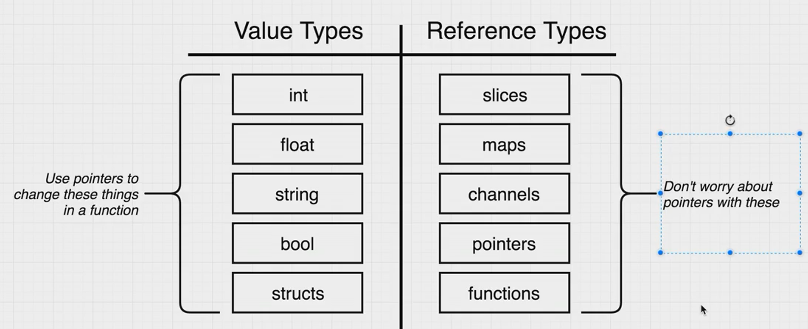

# 指针

函数一般是通过值进行传递，无法真正改变结构体中的值，如果想要真正改变，要使用指针。

使用`&`取得地址，使用`*`从 地址中取得值，`*person`代表数据类型为person的指针

```go
jimPointer := &jim
jimPointer.updateName("newName")
jim.print()


func (p *person) updateName(newFirstName string) {
	(*p).firstName = newFirstName
}

func (p person) print() {
	fmt.Printf("%+v", p)
}
```

## 自动转换

如果函数是一个*person类型的receiver，可以直接通过person类型进行调用，不用每次取地址，go语言会自动帮助我们取地址。

```go
jim.updateName("newName")
jim.print()

func (p *person) updateName(newFirstName string) {
	(*p).firstName = newFirstName
}
```

## 引用类型

引用类型不用取地址再进行传入也能改变对应的值，因为引用类型包含的是对实际对象的引用

