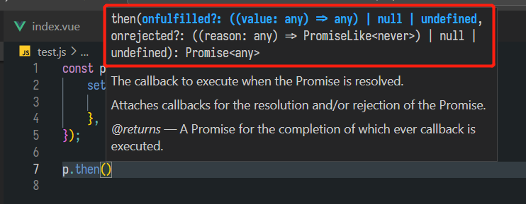

# Promise

> 这是ES6中出现的语法，一般Promise用于异步实现，Promise是一个构造函数，可以返回一个对象，不过有成功和失败两种情况可以处理，在创建之后，立即返回一个Promise对象，对应的回调会在Promise耗时操作执行完成之后执行，返回这个Promise对象之后，直接就可以执行之后的代码。

## 基本使用

### Promise的状态

Promise有三种状态

* pending
* fulfilled 完成
* rejected 失败

### 状态的改变

**创建Promise的语法为`new Promise((resolve,reject)=>{})`，调用resolve之后变为fulfilled ，调用reject方法之后变为rejected ，resolve和reject都可以接受一个参数（或者也可以不接受参数），这个参数分别在Promise之后的then和catch中进行捕捉。**

>Promise的状态改变是一次性的，即使调用完resolve再调用reject，还是为fulfilled状态

## Promise方法

### then方法

>改方法存在于Promise原型之上，类似于狗的实体类都有汪汪叫这么一个方法。



then中可以传递两个参数，一个用于处理当Promise状态变为fulfilled的情况，一个用于处理当Promise变成rejected的情况，通常情况下可以只写第一个参数，第二个用catch进行捕捉。

第一个方法的value参数是Promise中传入resolve的参数

第二个方法的reason参数是Promise中传入reject的参数

**then的返回值，仍然是一个Promise，状态是Pending，这样保证可以链式调用。**

如果Promise中的状态不改变，一直是Pending状态，则then中的方法都不会执行，只有状态改变才会触发相应的方法。

**then方法返回的Promise状态改变**的两种情况：

1. onfulfilled方法执行过程中**有return**会将Pending状态变为fulfilled，下一个then接收的参数就是返回值

>注意：如果代码都执行完，默认情况下返回undefined

```js
const p = new Promise((resolve, reject) => {
    setTimeout(() => {
        resolve('hello');
    }, 1000);
});

const t = p.then(
    (rse) => {
        console.log('success');
        return 123;
    },
    (reason) => console.log('failed')
);

t.then(
    (res) => {
        console.log('success 2', res);
    },
    (reason) => {
        console.log('failed 2', reason);
    }
);

// 输出
success
success 2 123
```

2. onfulfilled方法执行过程中**出错**会将Pending状态变为rejected，下一个then接收的参数是报错信息，对应的onrejected方法会被触发。

   ```js
   const p = new Promise((resolve, reject) => {
       setTimeout(() => {
           resolve('hello');
       }, 1000);
   });
   
   const t = p.then(
       (rse) => {
           console.log('success');
           // 这里修改了，会报错
           console.log(a);
           return 123;
       },
       (reason) => console.log('failed')
   );
   
   t.then(
       (res) => {
           console.log('success 2', res);
       },
       (reason) => {
           console.log('failed 2', reason);
       }
   );
   
   // 输出
   success
   failed 2 ReferenceError: a is not defined
       at D:\programe\code\Project\cz-blog-project\openSourceReference\vue-admin-box-template-master\vue-admin-box-template-master\js\test.js:10:21
   ```

### catch方法

用于捕捉错误，一般用then和catch进行搭配，不会在then中写两个方法。

## 传统写法

```javascript
const success = () => console.log('success');
const fail = () => console.log('fail');

const waitFunction = (time, success, fail) => {
    setTimeout(() => {
        let result = true;
        if (result) {
            success();
        } else {
            fail();
        }
    }, time);
};

waitFunction(1000, success, fail);
```

耗时操作执行完之后，根据结果决定是调用success还是fail。

## 改进写法

```javascript
const makeServerRequest = new Promise((resolve, reject) => {
  // responseFromServer 设置为 false，表示从服务器获得无效响应
  let responseFromServer = false;
  if(responseFromServer) {
    resolve("We got the data");
  } else {  
    reject("Data not received");
  }
});

// 成功之后会调用这个方法 result是传入resolve的参数
makeServerRequest.then(result => {
  console.log(result);
});

// 失败调用这个方法 error是传入reject的参数
makeServerRequest.catch(error =>{
    console.log(error);
})
```

上述的调用可以合并

```javascript
makeServerRequest
    .then((result) => {
        console.log(result);
    })
    .catch((error) => {
        console.log(error);
    });
```

## 链式调用

如果是传统的写法，会产生回调地狱，代码可读性差，通过Promise，只要上一个返回的也是Promise类型，就**可以用then链式调用，这些所用的异常都可以用catch进行捕获，执行过程中，只要这些代码中有一个发生了错误，就会被catch捕捉到。**

有回调地狱的代码

```javascript
setTimeout(() => {
    console.log('1s');
    setTimeout(() => {
        console.log('1s');
        setTimeout(() => {
            console.log('1s');
        }, 1000);
    }, 1000);
}, 1000);
```

链式调用的代码

```javascript
fetch('www.baidu,com')
    .then((response) => response.json())
    .then((json) => console.log(json))
    .catch((err) => console.log(err));
```

>fetch会返回一个Promise

## async await

>这种写法出现在ES7，目的是让异步编程写起来和同步没有什么区别

使用`await`关键字时候，该方法必须被声明为`async`，本质上还是将代码转为了Promise进行执行。

捕捉错误通过`try...catch...`来进行。

```javascript
const fetchData = async () => {
    try {
        const response = fetch('www.baidu.com');
        const json = await response.json();
        console.log(json);
    } catch (err) {
        console.log(err);
    }
};
```

要注意以下情况，这两个请求并不是异步发起的，而是执行完一个才会去执行另一个

```javascript
async () => {
    const resultOne = await fetch('xxx1');
    const resultTwo = await fetch('xxx2');
};
```

如果想要这两个请求异步的执行，需要将这两个组合为一个Promise。

```javascript
async () => {
    const PromiseOne = fetch('xxx1');
    const PromiseTwo = fetch('xxx2');

    const [resultOne, resultTwo] = await Promise.all([PromiseOne, PromiseTwo]);
};
```

