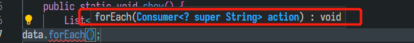

## lambda表达式

>如果一个接口内部只有一个方法，就可以用lambda表达式进行简化，接口中有默认方法无所谓

一个可以用lambda简化的接口

```java
public interface Printer {
    void print(String message);
    
    default void printTwice(String message){
        System.out.println(message);
        System.out.println(message);
    }
}
```

greet函数需要一个实现`Printer`接口的对象，对于**一次性**的对象，我们可以通过lambda表达式进行声明。

```java
public class LambdaDemo {
    public static void greet(Printer printer) {
        printer.print("hello world");
    }

    // 本来greet的参数是一个printer
    public static void show() {
        greet(msg -> {
            System.out.println(msg);
        });
        
        // 方法引用，与上面等效
        greet(System.out::println);
    }
}
```

1. 只有一个参数，括号可以省略
2. 只有一行代码，大括号可以省略
3. 默认最后一行作为返回值

lambda表达式还可以用值存起来，然后再传入

```java
Printer xxx = msg -> System.out.println(msg);
greet(xxx);
```

lambda表达式可以访问变量

```java
public static String suffix = "-";

public static void show() {
    String prefix = "-";
    greet(msg -> System.out.println(prefix + msg + LambdaDemo.suffix));
}
```

## 函数式接口

这些接口中都只有一个方法，全部可以同lambda表达式进行实现。

每个接口中对应的函数名字不一样，但是都只有一个函数。

### consumer

`void  consumer(obj)`:传入一个参数，但是什么都不返回，可以理解为消费了这个对象 。

使用`foreach`的时候，其实传入的就是consumer接口



consumer可以多个联合起来一起使用，需要使用`addthen`方法

```java
public static void show() {
    List<String> data = List.of("a", "b","c");
    Consumer<String> print = msg ->System.out.println(msg);
    Consumer<String> printUpperCase = msg -> System.out.println(msg.toUpperCase());

    data.forEach(print.andThen(printUpperCase));
}
```

>这个方法会针对每个String，先进行打印，再打印大写结果。即`aAbBcC`。

### supplier

`obj  consumer()`:不传入参数，返回一个对象，可以理解为提供了一个对象。

```java
 Supplier<Double> getRandom = ()->Math.random();
```

返回一个Double对象

### function

`obj map(obj`)：传入对象并且返回对象，可以理解为一种映射关系

```java
Function<String, Integer> getStrLength = str -> str.length();
// result: 3
System.out.println(getStrLength.apply("abc"));
```

### predicate

`boolean predicated(condition)`:根据条件返回一个boolean值，在filter中很有用

```java
Predicate<String> lengthIsGreaterThan5 = str -> str.length() > 5;
// result: false
System.out.println(lengthIsGreaterThan5.test("abc"));
```


