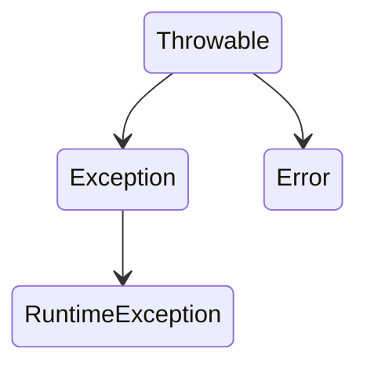
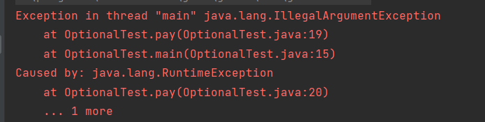

# 异常

## 异常的分类

异常分为三个类

* checked(对应Exception):这个异常程序必须进行处理，例如文件读取时候发生的IO异常
* unchecked(对应RuntimeException)：这种异常程序不是必须进行 处理，应该通过编码来改变这种异常，例如空指针异常、索引越界异常。
* Error(对应Error)：非常严重的错误，程序已经无法运行了，程序会自动终止，例如出现堆栈溢出。

## 异常类继承关系



>所有继承Exception的异常都是checked异常，继承RuntimeException的异常都是unchecked异常，那RuntimeException继承Exception是不是有点自相矛盾呢，确实，不过不用纠结，当时java设计成了这样而已，无伤大雅。

## 捕获异常

`try....catch...`

```java
try {
    FileReader fileReader = new FileReader("test.txt");
} catch (FileNotFoundException e) {
    e.printStackTrace();
}
```

抛出多个异常,多个异常可以多次catch也可以用`|`进行分割后统一捕获处理

```java
try {
    FileReader fileReader = new FileReader("test.txt");
} catch (FileNotFoundException|IOExceeption e) {
    e.printStackTrace();
}
```

在`try....catch...`之后，通常要执行一些关闭操作，例如关闭文件、数据库连接等，这些语句一般放在`finally`语句块中。

```java
FileReader fileReader = null;
try {
    fileReader = new FileReader("test.txt");
} catch (FileNotFoundException e) {
    e.printStackTrace();
} finally {
    try {
        fileReader.close();
    } catch (IOException e) {
        e.printStackTrace();
    }
}
```

**弊端：**

* `fileReader`为了让多个语句块都可以访问到，不得不扩大作用范围
* 调用close()方法的时候，也可能抛出异常，不得不再捕获一次异常，这样让整个流程十分繁琐

改进上面代码:

```java
try (FileReader reader = new FileReader("test.txt");) {
} catch (IOException e) {
    e.printStackTrace();
} 
```

* try后面类似于一个语句块，可以写多条
* reader从打开到关闭其实抛出了两个异常`FileNotFoundException`和`IOException`，只用捕获`IOException`的原因是``FileNotFoundException`继承于`IOException`。
* 要想写在try语句中，**必须实现`AutoCloseable`接口**，其父类Reader的声明为`public abstract class Reader implements Readable, Closeable`，其中`public interface Closeable extends AutoCloseable`

## 自定义异常

自定义异常通过继承现有的异常进行，继承Exception的异常都是checked异常，继承RuntimeException的异常都是unchecked异常。通常在异常的构造方法中会调用父类的构造方法(通过super关键字)。

## 向上抛出异常

异常并不是一定要在发生时进行`try....catch...`处理，可以将异常交给调用者处理。通过`throws`向上抛出异常，如果想在运行过程中抛出异常，使用`throw new ExceptionName()`，注意二者的区别，一个是`throws`，另一个是`throw`。

通过throw主动抛出异常

```java
public static void pay(float mount) {
    if (mount <= 0)
        throw new IllegalArgumentException();
}
```

通过throws向上抛出

```java
public static void pay(float mount) throws Exception {
    if (mount <= 0)
        throw new Exception();
}
```

>为啥IllegalArgumentException不用用throws声明而Exception用呢？
>
>答：IllegalArgumentException是unchecked，而Exception是checked。

## 异常chain

在堆栈信息中通常回看到XXX异常，然后`Caused By`另一个异常，这种情况下就是异常chain，可以理解为一个异常的发生导致了另一个异常的发生。

```java
public static void pay(float mount) {
    IllegalArgumentException exception = new IllegalArgumentException();
    RuntimeException runtimeException = new RuntimeException();
    exception.initCause(runtimeException);
    if (mount <= 0)
        throw exception;
}
```

异常最终抛出结果看下图，可以看到**IllegalArgumentException Caused by RuntimeException**。



上面的写法较为繁琐，可以通过构造函数进行简化。

下面代码和上面代码等价。

```java
public static void pay(float mount) {
    if (mount <= 0)
        throw new RuntimeException(new IllegalArgumentException());
}
```

调用了Runtime Exception的如下构造函数。

```java
public RuntimeException(Throwable cause) {
    super(cause);
}
```

