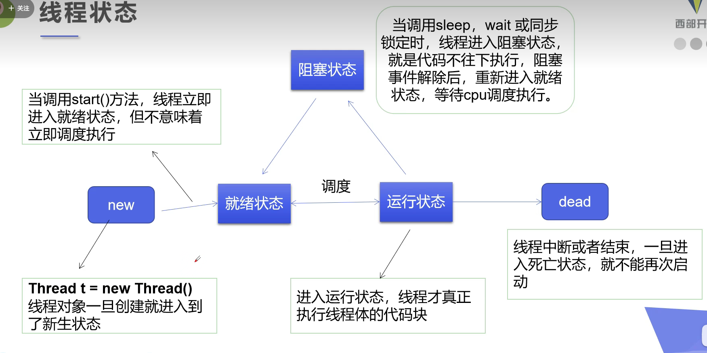

# 线程

## 线程和进程

进程就是运行的一个程序，一个进程可以有多个线程，即使这个进程没有创建线程一般也会有main线程和gc线程，cpu同时只能执行一个线程，当多个线程快速交替的时候，就和多个线程一起执行一样。:headphones:

线程是由操作系统的调度器来决定哪个线程执行的。

线程会带来额外的开销。

线程使用时候要注意并发问题。

## 线程的实现:accept:

### 集成Thread类

```java
public class ThreadTest01 extends Thread {
    @Override
    public void run() {
        for (int i = 0; i < 20; i++) {
            System.out.println("thread -->" + i);
        }
    }

    public static void main(String[] args) {
        ThreadTest01 test01 = new ThreadTest01();
        test01.start();

        for (int i = 0; i < 20; i++) {
            System.out.println("main -->"+i);
        }
    }
}
```

开启线程需要调用`start`方法，线程开启后不一定立即执行，具体是否执行由CPU的调度决定。如果调用`run`方法，也无法开启线程，就相当于普通的调用方法。

### 实现Runnable

```java
public class ThreadTest03 implements Runnable {

    @Override
    public void run() {
        for (int i = 0; i < 20; i++) {
            System.out.println("thread -->" + i);
        }
    }

    public static void main(String[] args) {
        ThreadTest03 test03 = new ThreadTest03();
        // 传入了接口
        new Thread(test03).start();


        for (int i = 0; i < 20; i++) {
            System.out.println("main -->"+i);
        }
    }
}
```

建议使用，这种方法更加具有灵活性，开启本质上也是调用start开启线程。

### Callable方式:cactus:

```java
/*
	继承Callable接口，可以拥有返回值
*/
public class ThreadTest04 implements Callable<Boolean> {
    private String url;
    private String name;

    public ThreadTest04(String url, String name) {
        this.url = url;
        this.name = name;
    }

    @Override
    public Boolean call() {
        WebDownloader webDownloader = new WebDownloader();
        webDownloader.download(url, name);
        System.out.println(name + " has been download");
        return true;
    }

    public static void main(String[] args) throws ExecutionException, InterruptedException {
        //开启三个线程线程下载图片
        ThreadTest04 t1 = new ThreadTest04("https://img-blog.csdnimg.cn/2019050219024732.png?x-oss-process=image/watermark,type_ZmFuZ3poZW5naGVpdGk,shadow_10,text_aHR0cHM6Ly9ibG9nLmNzZG4ubmV0L3FxXzM0ODY5OTkw,size_16,color_FFFFFF,t_70", "1.jpg");
        ThreadTest04 t2 = new ThreadTest04("https://img-blog.csdnimg.cn/2019050219024732.png?x-oss-process=image/watermark,type_ZmFuZ3poZW5naGVpdGk,shadow_10,text_aHR0cHM6Ly9ibG9nLmNzZG4ubmV0L3FxXzM0ODY5OTkw,size_16,color_FFFFFF,t_70", "2.jpg");
        ThreadTest04 t3 = new ThreadTest04("https://img-blog.csdnimg.cn/2019050219024732.png?x-oss-process=image/watermark,type_ZmFuZ3poZW5naGVpdGk,shadow_10,text_aHR0cHM6Ly9ibG9nLmNzZG4ubmV0L3FxXzM0ODY5OTkw,size_16,color_FFFFFF,t_70", "3.jpg");

		// 注意这里线程执行的方式和之前的不同
        
        //创建线程池 后台服务
        ExecutorService service = Executors.newFixedThreadPool(3);

        //提交 让线程执行
        Future<Boolean> submit1 = service.submit(t1);
        Future<Boolean> submit2 = service.submit(t2);
        Future<Boolean> submit3 = service.submit(t3);

        System.out.println(submit1.get()); //线程完了才能执行这个
        System.out.println(submit2.get());

        //关闭服务
        service.shutdownNow();
    }
}
```

## 线程的五个状态



通过代码获取线程的状态，具体的状态可以查看State这个枚举量。

```java
public class ThreadState {
    public static void main(String[] args) {
        Thread thread = new Thread(()->{
            for (int i = 0; i < 5; i++) {
                try {
                    Thread.sleep(100);
                } catch (InterruptedException e) {
                    e.printStackTrace();
                }
            }
            System.out.println("end");
        });
	
        // NEW
        Thread.State state = thread.getState();
        System.out.println("create -->"+state);

        // 开启线程
        thread.start();
        state = thread.getState();
        System.out.println(state);

        // 运行中判断状态
        while (state != Thread.State.TERMINATED) {
            try {
                Thread.sleep(100);
            } catch (InterruptedException e) {
                e.printStackTrace();
            }
            state = thread.getState();
            System.out.println(state);
        }
    }
}
```


## 停止线程

目前官方提供的停止线程的方法已经都被废弃，要想停止线程，最好的方法是在run的实现中设置标志位，可以通过重新设置暂停线程。

```java
public class StopTest implements Runnable {
    private boolean flag = true;

    @Override
    public void run() {
        int i = 0;
        while (flag) {
            System.out.println("thread run .. " + i);
            i++;
        }
    }

    public void stop() {
        this.flag = false;
    }

    public static void main(String[] args) {
        StopTest test = new StopTest();
        new Thread(test).start();
        for (int i = 0; i < 1000; i++) {
            System.out.println("main-->" + i);
            if (i == 900) {
                test.stop();
                System.out.println("线程停止");
            }
        }
    }
}
```

## 线程礼让 

`yield`就是暂时暂停当前线程，将cpu让出来，之后所有线程公平竞争，所以这个yield的线程仍然有可能被CPU执行，yield(礼让)不一定会成功。

```java
public class TestYield {
    public static void main(String[] args) {
        MyYield myYield = new MyYield();
		
        // 开启两个线程 测试是否礼让成功
        new Thread(myYield,"first").start();
        new Thread(myYield,"second").start();
    }

}

class MyYield implements Runnable {
    @Override
    public void run() {
        System.out.println(Thread.currentThread().getName() + "-->start");
        Thread.yield();
        System.out.println(Thread.currentThread().getName()+"-->end");
    }
}
```

## join:sailboat:

join可以理解为插队，让某个线程强制执行完之后再执行别的线程。

```java
public class TestJoin implements Runnable {
    @Override
    public void run() {
        for (int i = 0; i < 1000; i++) {
            System.out.println("this is vip" + i);
        }
    }

    public static void main(String[] args) throws InterruptedException {
        TestJoin testJoin = new TestJoin();
        Thread thread = new Thread(testJoin);
        thread.start();


        // main 线程
        for (int i = 0; i < 300; i++) {
            if (i == 200) {
                thread.join(); // 这个线程插队
            }
            System.out.println("main -->"+i);
        }
    }
}
```

## 线程的优先级

可以设置线程的优先级，优先级高的只是证明**获得调度的概率大，并不一定优先执行**，但是通常优先级高的会先执行，也有可能出现性能倒置的情况，优先级低的先执行。

```java
public class ThreadPriority {

    public static void main(String[] args) {
        System.out.println(Thread.currentThread().getName() + "-->" + Thread.currentThread().getPriority());

        MyPriority myPriority = new MyPriority();

        Thread t1 = new Thread(myPriority);
        Thread t2 = new Thread(myPriority);
        Thread t3 = new Thread(myPriority);
        Thread t4 = new Thread(myPriority);
        
        // 设置不同的优先级 最大是10 最小是1

        t1.start();

        t2.setPriority(8);
        t2.start();

        t3.setPriority(Thread.MIN_PRIORITY);
        t3.start();

        t4.setPriority(Thread.MAX_PRIORITY);
        t4.start();
    }
}

class MyPriority implements Runnable {
    @Override
    public void run() {
        System.out.println(Thread.currentThread().getName() + "-->" + Thread.currentThread().getPriority());
    }
}
```

## 守护线程

线程有两种，用户线程和守护线程

守护线程不一定需要执行完

用户线程必须执行完

用户线程都执行完毕，程序就执行完毕了，这时候守护线程就会被杀掉，一般守护线程都是GC、日志等线程，用户线程结束后，守护线程不是立即终止，java虚拟机停止还需要一定的时间。

```java
public class ThreadDaemon {
    public static void main(String[] args) {
        God god = new God();
        You you = new You();

        Thread thread = new Thread(god);
        thread.setDaemon(true); // 默认为false 所有创建的线程默认为用户线程
        thread.start();

        new Thread(you).start();
    }
}

class God implements Runnable {
    @Override
    public void run() {
        // 如果是用户线程就不会停止 但是是守护线程 自己就会终止
        while (true){
            System.out.println("this is daemon thread ...");
        }
    }
}

class You implements Runnable {
    @Override
    public void run() {
        for (int i = 0; i < 100; i++) {
            System.out.println("this is a user thread");
        }
    }
}
```

## 锁

### synchronized关键字

每个对象都有一把锁，Sleep并不会释放锁。

ArrayList是线程不安全的，当有多个线程同时操作的时候，同一块内存可能被多次写入。

```java
public class UnsafeList {
    public static void main(String[] args) {
        List<String> list = new ArrayList<>();

        // 两个线程对同一块内存读写 加了两次 实际只加了一个
        for (int i = 0; i < 1000; i++) {
            new Thread(() -> list.add(Thread.currentThread().getName())).start();
        }

        System.out.println(list.size());
    }
}
```

可以通过synchronize关键字加锁，方法上加锁，锁的对象默认是this，也可以通过`synchronize(加锁对象){代码块}`完成锁的操作。

```java
public class UnsafeList {
    public static void main(String[] args) {
        List<String> list = new ArrayList<>();

        // 两个线程对同一块内存读写 加了两次 实际只加了一个
        for (int i = 0; i < 1000; i++) {
            new Thread(() -> {
                // 加锁了
                synchronized (list) {
                    list.add("1");
                    System.out.println("hello");
                }
            }).start();
        }


        System.out.println(list.size());
    }
}
```

这里输出仍然不是1000，但是输出的hello肯定是1000，不是1000是因为别的线程还没执行完，main线程就开始执行

list.size()了，如果去掉锁，即使加上后面输出的hello，也凑不够1000个。这样加锁确实保证线程安全了。除此之外，也可以在后面加上sleep，这样也可以输出1000。

### 可重复锁

synchronized是隐式锁，除此之外还可以指定显示锁。其中`ReentrantLock`可重复锁，比较常见，下面是一个可重复锁的定义，需要自己加锁和释放锁，一般要将释放锁的部分放在`finally`语句块中。

```java
private final ReentrantLock lock = new ReentrantLock();

public void run(){
    try {
        lock.lock();
        // do something
    }finally {
        lock.unlock();
    }
}
```


### 死锁

同时想获得对方加锁的资源，互相不释放，造成死锁。

多个synchronized一起使用时容易出现这种情况。

## 生产者和消费者

一个线程用于生产，中间有中间件负责保存，之后多一个线程用于消费。

wait可以令当前线程暂停执行，并且不浪费资源，之后可以通过notifyAll方法对线程进行唤醒。二者都是位于Object中的方法。

```java
public class TestPC {
    public static void main(String[] args) {
        SyncContainer container = new SyncContainer();

        new Producer(container).start();
        new Consumer(container).start();

    }
}

// 生产者
class Producer extends Thread {
    SyncContainer container;

    public Producer(SyncContainer container) {
        this.container = container;
    }

    @Override
    public void run() {
        for (int i = 0; i < 100; i++) {
            container.push(new Message(i));
            System.out.println("生产者生产--->" + i);
        }
    }
}

// 消费者
class Consumer extends Thread {
    SyncContainer container;

    public Consumer(SyncContainer container) {
        this.container = container;
    }

    @Override
    public void run() {
        for (int i = 0; i < 100; i++) {
            Message pop = container.pop();
            System.out.println("消费者消费-->" + pop.id);
        }
    }
}

// 货物
class Message {
    int id;

    public Message(int id) {
        this.id = id;
    }
}

// 缓冲区
class SyncContainer {
    int count = 0;
    Message[] msgs = new Message[10];

    // 生产
    public synchronized void push(Message message) {
        if (count == msgs.length) {
            // 满了 通知消费者消费
            try {
                this.wait(); // 暂时停止生产
            } catch (InterruptedException e) {
                e.printStackTrace();
            }
        }
        //没满 继续生产
        this.msgs[count] = message;
        count++;
        this.notifyAll(); // 生成完成 通知消费者消费 唤醒wait的线程
    }

    // 消费
    public synchronized Message pop() {
        if (count == 0) {
            try {
                this.wait();
            } catch (InterruptedException e) {
                e.printStackTrace();
            }
        }
        // 消费
        count--;
        Message msg = this.msgs[count];

        this.notifyAll(); // 消费完成，让生产者生产
        return msg;
    }
}
```

还可以通过标志位来标记生产者和消费者，这种方法没有中间的缓存区。模拟了演员演电视和观众观看电视，只有在演员演完电视之后，观众才可以观看电视。

```java
public class TestPC2 {
    public static void main(String[] args) {
        TV tv = new TV();

        new Player(tv).start();
        new Watcher(tv).start();
    }
}

class Player extends Thread {
    TV tv;

    public Player(TV tv) {
        this.tv = tv;
    }

    @Override
    public void run() {
        for (int i = 0; i < 10; i++) {
            if (i % 2 == 0) {
                tv.play("hello world");
            } else {
                tv.play("nothing");
            }
        }
    }
}

class Watcher extends Thread {
    TV tv;

    public Watcher(TV tv) {
        this.tv = tv;
    }

    @Override
    public void run() {
        for (int i = 0; i < 10; i++) {
            tv.look();
        }
    }
}

class TV {
    // flag = true Player播放，Watcher等待
    // flag = false Watcher看，Player等待
    String name;
    boolean flag = true;


    public synchronized void play(String name) {
        if (!flag) {
            try {
                this.wait();
            } catch (InterruptedException e) {
                e.printStackTrace();
            }

        }
        System.out.println("player is play " + name);
        this.name = name;
        this.notifyAll();
        this.flag = !this.flag;
    }

    public synchronized void look() {
        if (flag) {
            try {
                this.wait();
            } catch (InterruptedException e) {
                e.printStackTrace();
            }
        }
        System.out.println("watching " + this.name);
        this.notifyAll();
        this.flag = !this.flag;
    }
}
```

## 线程池:page_with_curl:

线程频繁创建和销毁非常消耗资源，可以创建一个池子，提前创建多个线程，之后按需取用，用完再放回去。

```java
public class TestPool {
    public static void main(String[] args) {
        // 创建有10个线程的线程池
        ExecutorService executorService = Executors.newFixedThreadPool(10);

        executorService.execute(new MyThread());
        executorService.execute(new MyThread());
        executorService.execute(new MyThread());
        executorService.execute(new MyThread());

        executorService.shutdownNow();
    }
}

class MyThread implements Runnable {

    @Override
    public void run() {
        System.out.println(Thread.currentThread().getName());
    }
}
```

>`java.util.concurrent`是java用于处理并发的包