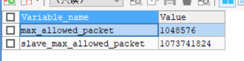
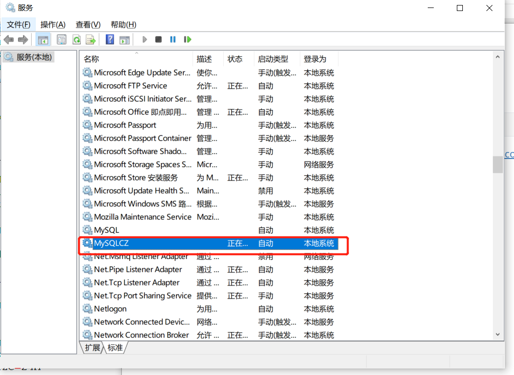

# 更改配置

## 更改交互大小

传给mysql的包，其大小会收到`max_allowed_packet`参数的限制，如果想要传递较为大的数据包，就要更改这个设置。

### 查看该设置

```mysql
SHOW VARIABLES LIKE '%max_allowed_packet%';
```



### 进行修改

#### 查询语句修改

```mysql
SET GLOBAL max_allowed_packet = 20*1024*1024;
```

参考:https://stackoverflow.com/questions/14211241/max-allowed-packet-could-not-be-set-in-mysql-5-5-25

这个变量再设置之后需要重新连接数据库才能起作用，否则一直是之前的值。

#### 文件修改

在ini文件中也可以进行修改(该文件在mysql的安装目录下)

在`[mysqld]`标签下添加


之后再服务中重启mysql对应的服务即可完成修改

