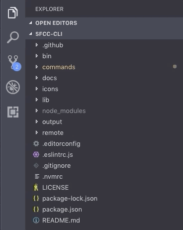
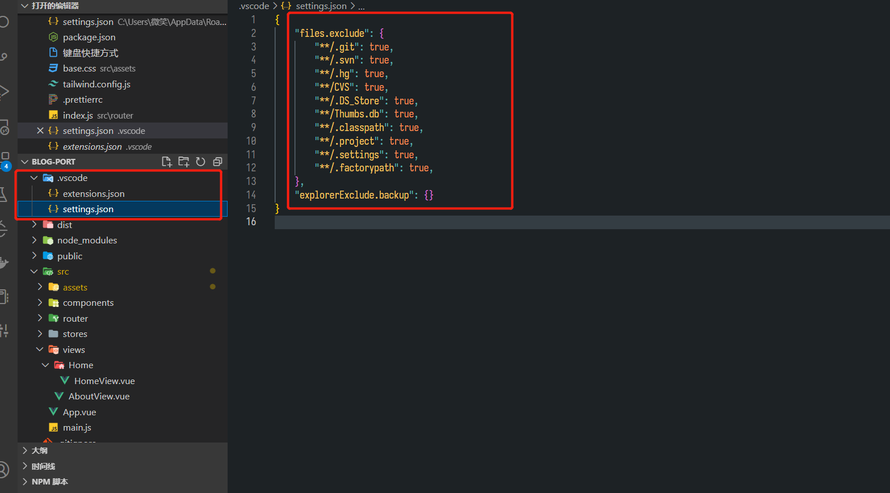

# 插件推荐

## Explorer Exclude

可以隐藏文件，例如不想看见`node_modules`或者`.git`文件

### 手动配置

### json配置

## Better Comments

可以给插件进行高亮，具体关键字见下图

## colorize

颜色更加可视化，在写css的时候尤其有用

## project manager

管理项目，可以迅速切换项目

## Todo Tree

以树形结构查看项目中的todo，fixme等

