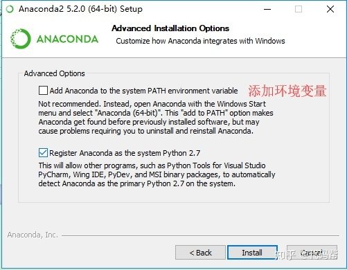
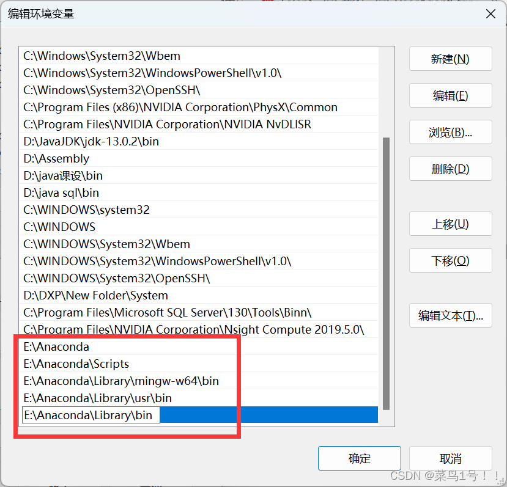
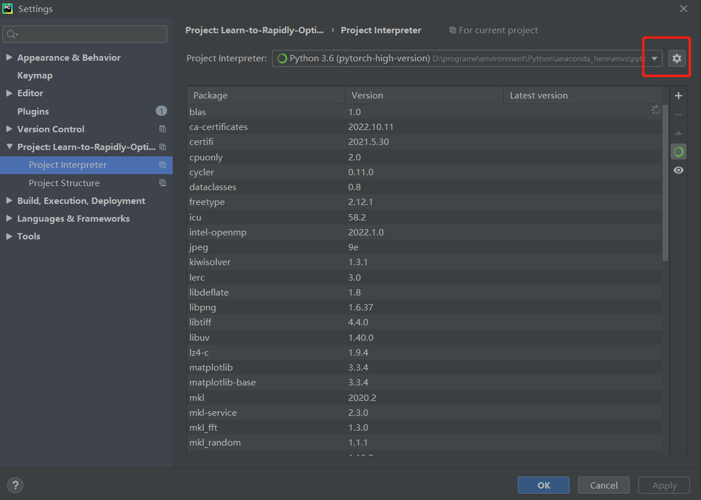
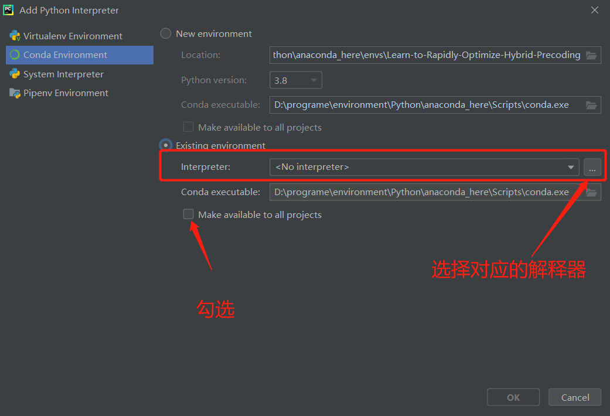

# Conda环境配置

## 安装

安装的时候不要添加环境变量，自己之后手动添加



环境变量中的相关路径如下



## 查看

```bash
# 查看所有环境
conda info --envs
conda env list
# 查看环境下安装的包
conda list
```

## 创建

```bash
# 创建环境
conda create --name EnvName python=3.6
# 激活环境
activate EnvName
# 之后可以安装工具包之类的
```

## 删除环境

```bash
conda env remove -n EnvName
```

## 在pycharm中添加环境





>添加Conda环境，第一个虚拟环境会在当前目录下创建env文件夹，相当于把现有的一个环境映射过来了