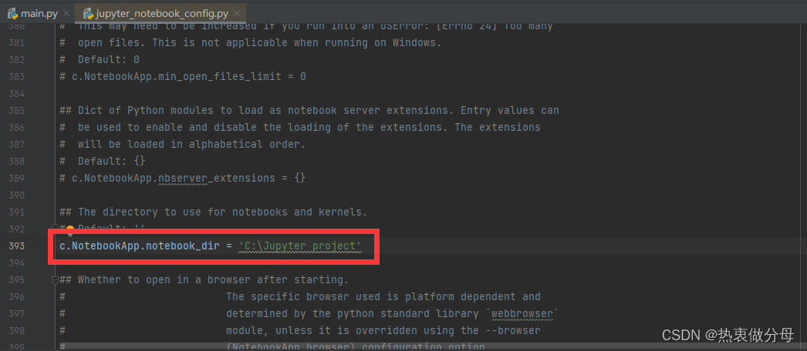
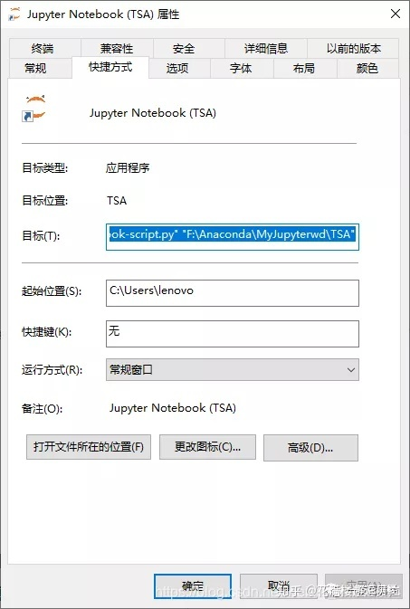

# jupyter notebook

默认是在安装完conda之后就会安装好jupyter notebook

## 指定启动后的默认位置

### 更改配置文件

1. 生成默认的配置文件

   打开Anaconda Prompt，输入

   ```bash
   jupyter notebook --generate-config
   ```

2. 改写配置文件中的属性

    找到生成路径下的jupyter_notebook_config.py

   改写其中的`c.NotebookApp.notebook_dir`属性

   

### 更改启动项

右击Jupyter Notebook——属性——目标框格，将**"%USERPROFILE%/"**删掉，换成你想要设定的工作目录的路径即可。



## 切换不同环境

在创建虚拟环境TSA之后，在**Anaconda Pronmpt**中输入**conda activate 环境名称**

之后再该环境下再安装一个jupyter就行了，**conda install jupyter**，这时候新的jupyter就使用了对应的环境。

