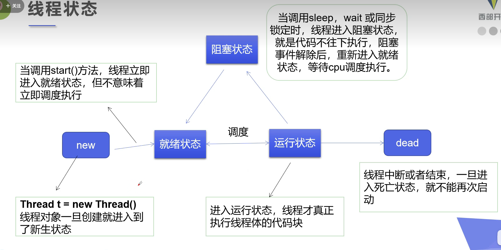

# 线程

## 线程和进程

进程就是运行的一个程序，一个进程可以有多个线程，即使这个进程没有创建线程一般也会有main线程和gc线程，cpu同时只能执行一个线程，当多个线程快速交替的时候，就和多个线程一起执行一样。:headphones:

线程是由操作系统的调度器来决定哪个线程执行的。

线程会带来额外的开销。

线程使用时候要注意并发问题。

## 线程的实现:accept:

### 集成Thread类

```java
public class ThreadTest01 extends Thread {
    @Override
    public void run() {
        for (int i = 0; i < 20; i++) {
            System.out.println("thread -->" + i);
        }
    }

    public static void main(String[] args) {
        ThreadTest01 test01 = new ThreadTest01();
        test01.start();

        for (int i = 0; i < 20; i++) {
            System.out.println("main -->"+i);
        }
    }
}
```

开启线程需要调用`start`方法，线程开启后不一定立即执行，具体是否执行由CPU的调度决定。如果调用`run`方法，也无法开启线程，就相当于普通的调用方法。

### 实现Runnable

```java
public class ThreadTest03 implements Runnable {

    @Override
    public void run() {
        for (int i = 0; i < 20; i++) {
            System.out.println("thread -->" + i);
        }
    }

    public static void main(String[] args) {
        ThreadTest03 test03 = new ThreadTest03();
        // 传入了接口
        new Thread(test03).start();


        for (int i = 0; i < 20; i++) {
            System.out.println("main -->"+i);
        }
    }
}
```

建议使用，这种方法更加具有灵活性，开启本质上也是调用start开启线程。

### Callable方式:cactus:

```java
/*
	继承Callable接口，可以拥有返回值
*/
public class ThreadTest04 implements Callable<Boolean> {
    private String url;
    private String name;

    public ThreadTest04(String url, String name) {
        this.url = url;
        this.name = name;
    }

    @Override
    public Boolean call() {
        WebDownloader webDownloader = new WebDownloader();
        webDownloader.download(url, name);
        System.out.println(name + " has been download");
        return true;
    }

    public static void main(String[] args) throws ExecutionException, InterruptedException {
        //开启三个线程线程下载图片
        ThreadTest04 t1 = new ThreadTest04("https://img-blog.csdnimg.cn/2019050219024732.png?x-oss-process=image/watermark,type_ZmFuZ3poZW5naGVpdGk,shadow_10,text_aHR0cHM6Ly9ibG9nLmNzZG4ubmV0L3FxXzM0ODY5OTkw,size_16,color_FFFFFF,t_70", "1.jpg");
        ThreadTest04 t2 = new ThreadTest04("https://img-blog.csdnimg.cn/2019050219024732.png?x-oss-process=image/watermark,type_ZmFuZ3poZW5naGVpdGk,shadow_10,text_aHR0cHM6Ly9ibG9nLmNzZG4ubmV0L3FxXzM0ODY5OTkw,size_16,color_FFFFFF,t_70", "2.jpg");
        ThreadTest04 t3 = new ThreadTest04("https://img-blog.csdnimg.cn/2019050219024732.png?x-oss-process=image/watermark,type_ZmFuZ3poZW5naGVpdGk,shadow_10,text_aHR0cHM6Ly9ibG9nLmNzZG4ubmV0L3FxXzM0ODY5OTkw,size_16,color_FFFFFF,t_70", "3.jpg");

		// 注意这里线程执行的方式和之前的不同
        
        //创建线程池 后台服务
        ExecutorService service = Executors.newFixedThreadPool(3);

        //提交 让线程执行
        Future<Boolean> submit1 = service.submit(t1);
        Future<Boolean> submit2 = service.submit(t2);
        Future<Boolean> submit3 = service.submit(t3);

        System.out.println(submit1.get()); //线程完了才能执行这个
        System.out.println(submit2.get());

        //关闭服务
        service.shutdownNow();
    }
}
```

## 线程的五个状态



## 停止线程

目前官方提供的停止线程的方法已经都被废弃，要想停止线程，最好的方法是在run的实现中设置标志位，可以通过重新设置暂停线程。

```java
public class StopTest implements Runnable {
    private boolean flag = true;

    @Override
    public void run() {
        int i = 0;
        while (flag) {
            System.out.println("thread run .. " + i);
            i++;
        }
    }

    public void stop() {
        this.flag = false;
    }

    public static void main(String[] args) {
        StopTest test = new StopTest();
        new Thread(test).start();
        for (int i = 0; i < 1000; i++) {
            System.out.println("main-->" + i);
            if (i == 900) {
                test.stop();
                System.out.println("线程停止");
            }
        }
    }
}
```

## 线程礼让 

`yield`就是暂时暂停当前线程，将cpu让出来，之后所有线程公平竞争，所以这个yield的线程仍然有可能被CPU执行，yield(礼让)不一定会成功。

```java
public class TestYield {
    public static void main(String[] args) {
        MyYield myYield = new MyYield();
		
        // 开启两个线程 测试是否礼让成功
        new Thread(myYield,"first").start();
        new Thread(myYield,"second").start();
    }

}

class MyYield implements Runnable {
    @Override
    public void run() {
        System.out.println(Thread.currentThread().getName() + "-->start");
        Thread.yield();
        System.out.println(Thread.currentThread().getName()+"-->end");
    }
}
```

## join:sailboat:

join可以理解为插队，让某个线程强制执行完之后再执行别的线程。

```java
public class TestJoin implements Runnable {
    @Override
    public void run() {
        for (int i = 0; i < 1000; i++) {
            System.out.println("this is vip" + i);
        }
    }

    public static void main(String[] args) throws InterruptedException {
        TestJoin testJoin = new TestJoin();
        Thread thread = new Thread(testJoin);
        thread.start();


        // main 线程
        for (int i = 0; i < 300; i++) {
            if (i == 200) {
                thread.join(); // 这个线程插队
            }
            System.out.println("main -->"+i);
        }
    }
}
```

