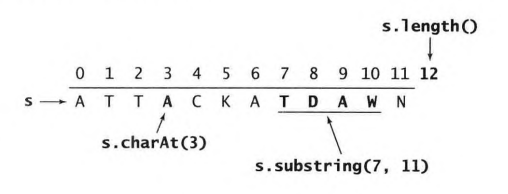
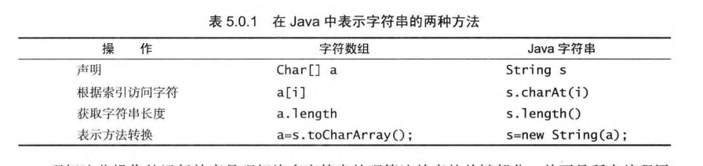
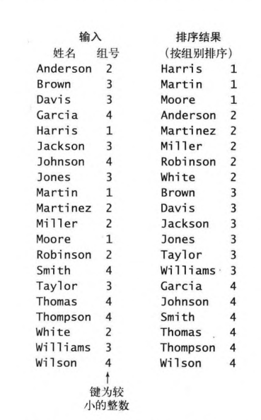
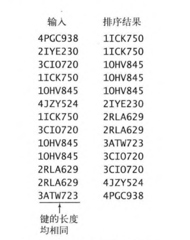
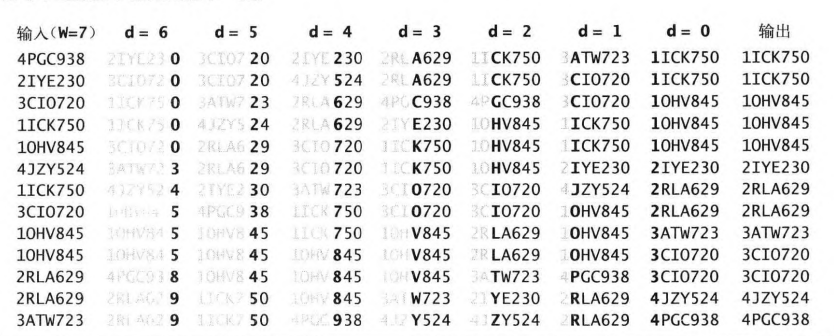

# String

## 基本操作





一般字符数组的表示方式要快于字符串的表示方式

## 键索引计数法



原来的输入是依靠姓名进行排序的，现在想要根据组号进行排序，并且姓名的排序方式不变，有点类似于二次排序。

分析：每次排序之后，名字在前面的如果组号相同之后还会在前面 ，所以只需要创建一个新的数组记录每个组新的位置即可。

伪代码：

```java
// input : a 
int N = a.length;

String aux[] = new String[N]; // 最终输出结果
int[] count = new int[R+1]; // R对应的小组个数 

// a[i].key() 将会返回组号
// 计算出现频率
for(int i = 0;i<R+1;i++)
    count[a[i].key()+1]++;
// 将频率转化为索引
for(int r = 0 ; r < R ; r++)
    count[r]+=count[r+1]
//将数据放到对应位置 放完之后对应位置+1
for(int i=0; i < N;i++)
    aux[count[a[i].key()]++]=a[i];
```

该算法的复杂度为O(N)，线性时间

## 低位优先的字符串排序

记录车牌号，找出其中重复的车牌号。

分析：车牌号的位数是固定的，其实本质就是一个定长字符串排序问题，排序完成之后，再统计重复数量。





从最后一位开始，根据`键索引计数法`的排序方法，对每一位进行一次排序，得到最终的结果。**每次排序可以将后面的视为已经排序完成，前面的那个是组号**。排序的次数和字符串的长度相同。（字符串越往前，排序中的实际优先级越高，类似于最终的组号，所以要从后往前进行遍历，不能从前往后遍历）

伪代码：

```java
// input a     W是a中一个元素的长度
int N = a.length;
int R = 256; //描述每个位置最多有多少种字符
String aux= new String[N];

for(int d=W-1; d>0 ;d--)
    int count=new int[R+1];
	for(int i =0 ;i<N ;i++)
        count[a[i].charAt(d)+1]++
	for(int r=0;r<R;r++)
        count[r]+=count[r+1]
	for(int i=0;i<N;i++)
        aux[count[a[i].charAt(d)++]]=a[i]
	for(int i=0;i<N;i++)
        a[i]=aux[i]
```

