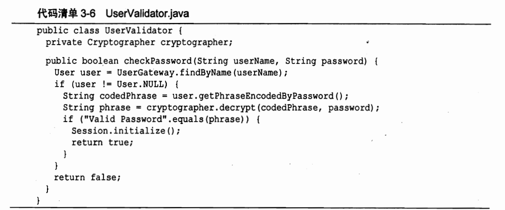

# 如何写出好代码

## 命名

命令最重要的是有意义，对于阅读代码的人可以见名知意，在开发过程中，其实大部分时间都在写代码，只有少部分的时间在开发

命名要可以使用**驼峰命名法**，避免使用a、b、c这种东东，对于一些常量，尽量抽出来，变成有描述意义的信息，别直接放进去。7和DAY_OF_WEEK的差距显而易见。

**避免误导**：尽量不要用缩写，但是针对计算机的缩写，可以放心使用，毕竟看代码的都是懂计算机的。accountList在使用的时候，不要直接认定这个就是一个ArrayList类型，List对于程序员来说有特殊的意义，可以考虑使用accountGroup等命名 。

**有意义的命名**：`copy(char a1[],char a2[])`可以进化为`copy(char source[],char destination[])`。	`Product`、`ProductInfo`、`ProductData`其实都描述的一个东西，等价的情况下，名字应该越短越好，所以这种 情况下可以选择`Product`。

**可搜索名称**：很多时候写代码依靠编辑器的自动提示和搜索功能，当在命名一堆相关的常量时候，如果时间相关的常量，可以考虑`TIME_XXX`，这样在输入`TIME`的时候，就可以自动进行提示，也方便搜索。

**成员前缀**：有些时候，类的成员变量会以`m`开头标识成员变量，在现代编辑器中，其实是不必要的，例如在IDEA中，成员变量会以特殊的颜色进行标识，没有必要在添加`m`。

**每个概念对应一个词**：获取某个东西，如果使用get就都用get，别一会fetch一会retrieve，应该保证命名的整体统一。

## 函数

**只做一件事**：函数应该尽量短小，每一个函数只对应一个功能。

**每个函数应该对应一个层级**：例如一个函数中包含业务逻辑，也包含一些算法逻辑就不是一个好的设计，又有高层对的东西又有很底层的东西，应该将同一个抽象层级的放在一起。

**函数参数**：最理想的参数是零个，总之参数越少越好。一方面方便测试，多个参数往往意味着耦合度比较高。

**不要有输出参数**：输入一个对象，在函数内进行修改之后，应该将这个对象返回，别返回一个void，如果不返回，从某种程度上你就不知道对这个对象进行了什么修改，有点对外界“不可见”。**这种做法其实也不是最好的，如果真的是只对某一个对象操作，应该声明为这个对象的成员方法。**

**避免标识参数**：如果传入一个boolean值进行判断之后执行不同的逻辑，完全可以创建两个函数执行不同的情况，将函数进一步细分。

**动词关键词**：函数命名的时候通常要加入动词，用以标记这个函数是干什么的。

**无副作用**：下面代码中，checkPassword本来只需要检查代码正确与否，但是有`Session.initialize()`，这意味着，在检查的时候可能错误得引发session的初始化，正确的做法是将init剥离出来，这里init就是这个函数产生的“副作用”。

## 注释

>理论上代码能少就少，最好代码是自解释

**TODO：**用TODO是一个好习惯，但是大量TODO不及时清理就会给整个系统带来垃圾

名字是自解释的，就不要增加没有必要的注释。

不要注释掉代码而不删除，别人会以为你还要用，可以选择直接删除，git等版本管理工具会保证对应的代码不会丢失。

注释要保持就近原则，确保注释是解释附近的代码的。

## 格式

> 现代IDEA可以满足大部分通用格式的需要，但是例如函数的位置等，还是需要人手动进行调整的。

**垂直分割**：函数和函数之间，不同的功能块之间应该留有适当的空格。注意空格行数的统一，IDEA不会自动增减空行。

**垂直顺序：**函数之间如果有依赖关系，应该尽量靠在一起，并且函数出现的顺序与使用的顺序相同。

## 错误处理

>错误处理的前提是响应的代码不能扰乱原来的代码逻辑

**异常LOG**：LOG是排除异常的关键信息，当有哦异常抛出时，要用log打印响应的数据，只打印追踪堆栈的意义其实不大。

**不要返回NULL**：JAVA中的空指针异常是一大难题，返回NULLL很可能调用的时候没有检查空指针异常，可以用Optional进行一个封装，代表可能返回NULL，或者返回一个默认的特例对象。

## 单元测试

>测试代码通常会多于生产代码，但是测试代码和生产代码一样重要，都应该有良好的编码规范。

理论上每次应该先有测试，有不同过的测试之后，再编写生产代码通过测试。