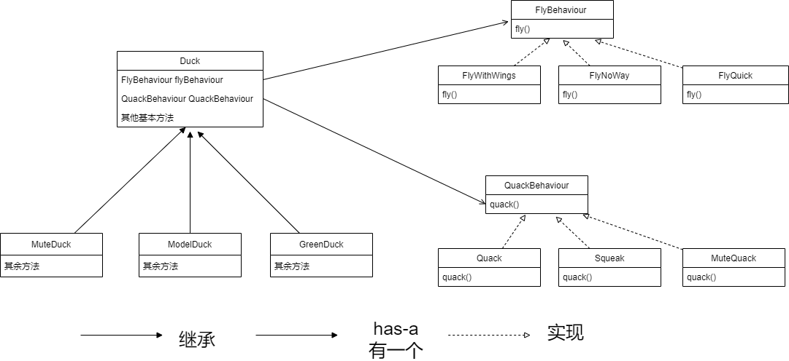

# 策略模式

## 传统

传统面向对象的编程中，通过继承一个类来完成代码的复用。

但是会产生如下问题：

* 基类中有的属性，并不是所有的子类的需要
* 一旦改动基类，所有的子类可能都需要变动

## 策略模式

* 将变动的部分用接口实现，不变动的部分封装在基类中
* 多用组合，少用继承
* 多使用接口，而不是使用具体的实现

使用策略模式之后，对于不变的内容，封装在基类中，也就是Duck中，Duck一般有Fly（飞）和Quack（叫）的行为，但是这个行为很不固定，是变化的内容，通过**接口**的方式来实现，接口代表一种能力。

通过**多态**语法，Duck拥有接口作为属性，可以在运行时动态指定具体的属性，不会写死，当有新的Fly和Quack行为时，只需要继续添加实现即可。