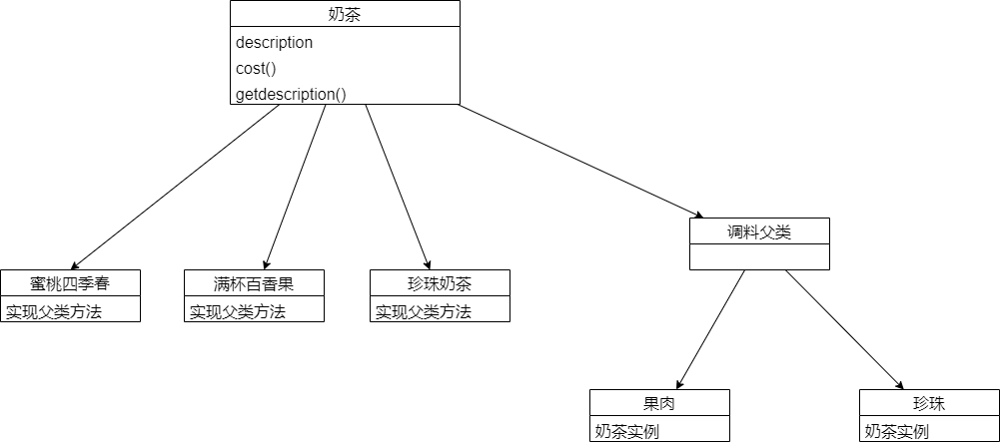

# 装饰者模式

动态的加功能添加到某个类之上，完成类功能的扩展，就像点奶茶增加了果肉和珍珠一样。

## 适用场景

以蜜雪冰城点奶茶为例子。奶茶为父类，蜜雪冰城的所有产品都是派生于这个基类，但是除了有基本类之外，我们还可以额外的增加珍珠或者果肉。假设要获取某个商品的价格，需要实现基类中的`cost`方法，如果要覆盖所有的产品，我们可能得实现珍珠奶茶类、蜜桃四季春类、满杯百香果类等，但是我们还需要实现珍珠奶茶+一份珍珠，蜜桃四季春+一份果肉这样的类，有很多种组合，可能会导致类爆炸。

进一步解决这个问题，可以在奶茶中添加返回配料的方法，例如get珍珠()，和get果肉()分别返回一份奶茶中拥有的果肉或者珍珠的数量，为了复用代码，最好将这些方法写在父类中，但是**不同奶茶的配料是不同的**，会导致很多“没必要”添加的方法添加到类中。

弊端：在有新调料出现之后，我们需要修改代码，并且如果调料很多的话，代码会非常复杂。

**装饰者模式**

* 创建饮料:milk_glass:
* 用各种调料装饰这个饮料:deciduous_tree:
* 最后的对象返回价格时，层层调用里面的方法

## 类图



## 简单实现

最基本类

```java
public abstract class MilkTea {
    public String description = "unkonwn milk tea";

    public String getDescription() {
        return description;
    }

    public abstract double cost();
}
```

装饰者子类

```java
public abstract class Ingredient extends MilkTea {
    @Override
    public abstract String getDescription();
}
```

奶茶具体类

```java
public class ManBeiBaiXiangGuoMikeTea extends MilkTea {

    ManBeiBaiXiangGuoMikeTea(String description) {
        this.description = description;
    }

    @Override
    public double cost() {
        return 10;
    }
}
public class ZhenZhuMikeTea extends MilkTea {

    ZhenZhuMikeTea(String description) {
        this.description = description;
    }

    @Override
    public double cost() {
        return 7.5;
    }
}
```

配料具体类

```java
public class GuoRou extends Ingredient {
    MilkTea milkTea;

    GuoRou(MilkTea milkTea) {
        this.milkTea = milkTea;
    }

    @Override
    public String getDescription() {
        return milkTea.getDescription() + ",一份果肉";
    }

    @Override
    public double cost() {
        return milkTea.cost() + 0.5;
    }
}

public class ZhenZhu extends Ingredient {
    MilkTea milkTea;

    ZhenZhu(MilkTea milkTea) {
        this.milkTea = milkTea;
    }

    @Override
    public String getDescription() {
        return milkTea.getDescription() + ",一份珍珠";
    }

    @Override
    public double cost() {
        return milkTea.cost()+2;
    }
}
```

测试结果，一份珍珠奶茶，加两份珍珠

```java
public class main {
    public static void main(String[] args) {
        MilkTea zhenZhuMikeTeaAddZhenZhu = new ZhenZhuMikeTea("珍珠奶茶");
        zhenZhuMikeTeaAddZhenZhu = new ZhenZhu(zhenZhuMikeTeaAddZhenZhu);
        zhenZhuMikeTeaAddZhenZhu = new ZhenZhu(zhenZhuMikeTeaAddZhenZhu);
        System.out.println(zhenZhuMikeTeaAddZhenZhu.getDescription());
        System.out.println(zhenZhuMikeTeaAddZhenZhu.cost());
    }
}

/**
输出：
珍珠奶茶,一份珍珠,一份珍珠
11.5
*/
```

