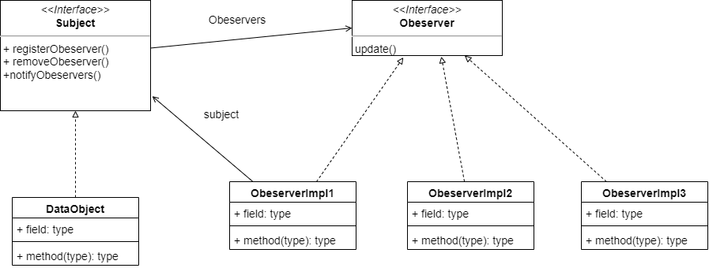

# 观察者模式

## 对象

观察者模式主要涉及两个对象。

一个是往外发送数据的，也就是被观察者，类似于报社，被观察者需要实现注册观察者和删除观察者的方法，还需要实现将数据发送给观察者的方法，这里用Subject（主题）接口来表示。

一个是接收数据的，是观察者，类似于订报的人，只需要可以接收被观察者发送的数据即可。

## 类图

Subject有具体的实现类DataObject，Subject中持有许多Observe的引用，也就是Observes数组，对于每一个实现Obeserver的类，都需要有主题的引用，来完成主题的注册，删除等（这里不持有对应的引用也是可以的）。

>java中有这种设计模式的实现类，Subject是Observable，观察者就是Obeserver。都在java.util包下，只不过Observable多了个setupdate方法，只有设置为true，才可以往外面发数据。

​                                                                                                                                                                                                                                                                                                                                                                                                                                                                                                                                                                                                                                                                      

## 应用

在许多ui界面开发时，使用SetOnClickListener其实就是使用了观察者模式。