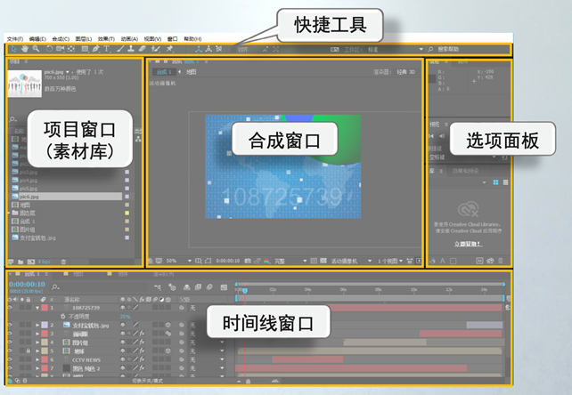
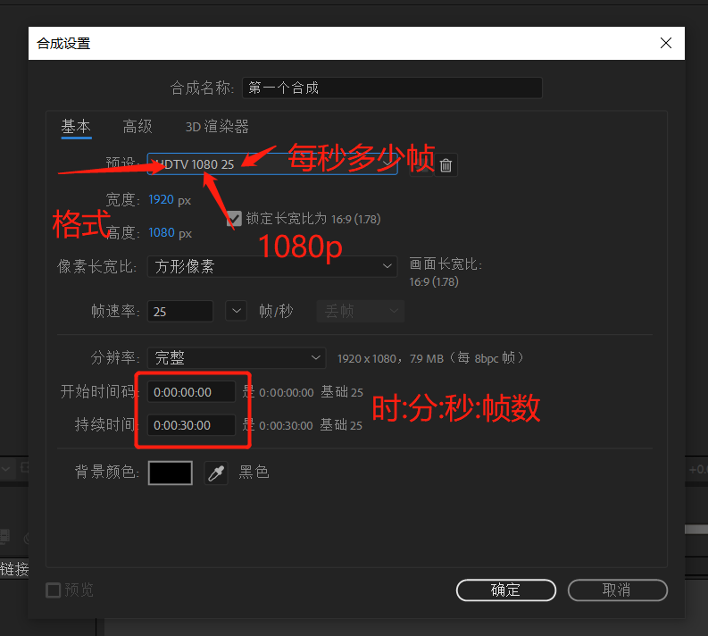
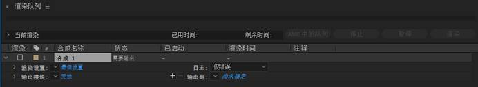

# AE学习记录

## AE的窗口布局

## 新建合成

## 导出视频

文件菜单——导出——添加到渲染队列

快捷键 ctrl+m

## 常用快捷键

|   快捷键    |             作用             |
| :---------: | :--------------------------: |
|  Alt+鼠标   |         完成标尺缩放         |
|   Crtl+k    |         修改合成参数         |
|      B      |     设置预览轴从这里开始     |
|      N      |        设置预览轴结束        |
|             | 预览轴就是每次按空格播放的轴 |
| Alt+`[`/`]` |    将素材左边/右边裁剪掉     |

