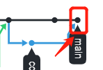
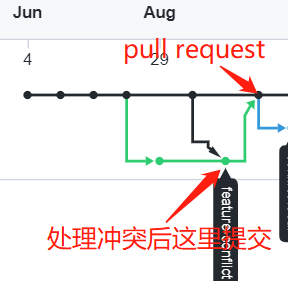

# branch分支合并

## 本地合并

创建branch之后，在新的branch和main上都进行提交，可能会产生conflict，解决conflict之后，再次commit即可。

如果main合并branch，也就是执行`git co main;git merge branch`，解决冲突之后再提交，新的提交会出现在main上。

也就是创建了一个新的提交用于处理冲突。

## GitHub通过pull request提交

在GitHub上创建pull request，将branch合并到main中，会提示有conflict，解决conflict之后，再执行pull request，最后执行的图如下所示。

处理冲突后提交在了branch分支上，这样不会影响main分支的修改，之后再通过pull request将branch上的修改合并到main分支之上。