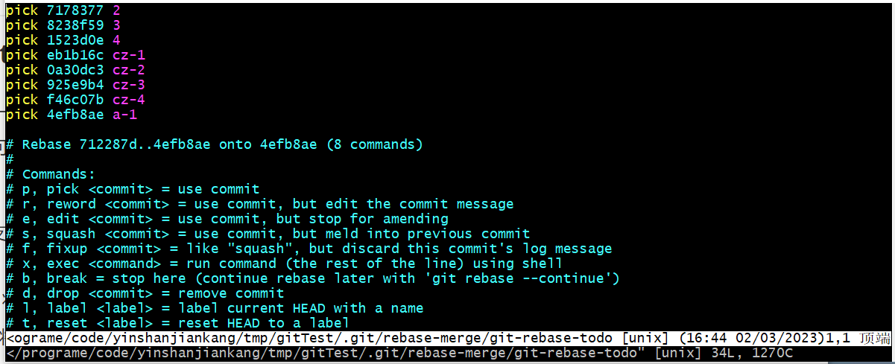

# 多人协同合作

## 合并

### 发起pull request

现在远程分支在main分支上，要在dev-cz分支上进行开发

在dev-cz进行开发之后，可以push到云端

在云端有dev-cz分支之后，可以发起**pull request**，将dev-cz合并到main分支之上

* merge ： 在main分支上会包含dev-cz所有新的commit，**并添加一个新的commit，显示`merge dev-cz to main`**。
* squash and merge：将所有dev-cz的commit压缩成一个commit，之后添加到main分支之后
* rebase and merge：将所有dev-cz的commit放在main之后，没有新的commit产生

### 另一名开发者同步


## git rebase让历史更干净

`git rebase -i commitId` 对到commitId的这些commit进行操作。

将会进入类似的界面，**上面的是时间最早的提交，下面是较晚的提交。**



### 改变顺序

使用`pick`,移动文件中的顺序最终的顺序就会改变。

### 删除commit

直接在文件中删除对应的commit之后`:wq`，删除commit之后，对应的文件修改也会消失

### 更新commit信息

r或reword，用这个作为开头修改紫色的内容。

### 压缩commit

f或者fixup，前面写上f的会被压缩到其他commit中，会**压缩到较早的提交中**。

## 删除远端分支

```bash
# 删除tracking branch
git branch --delete --remotes tracking-branch-name

# 删除remote branch 注：只执行这条命令，对应的tracking branch也会被删除
git push origin --delete remote-branch-name

# 删除不用的local tracking branch
git remote origin prune
```

