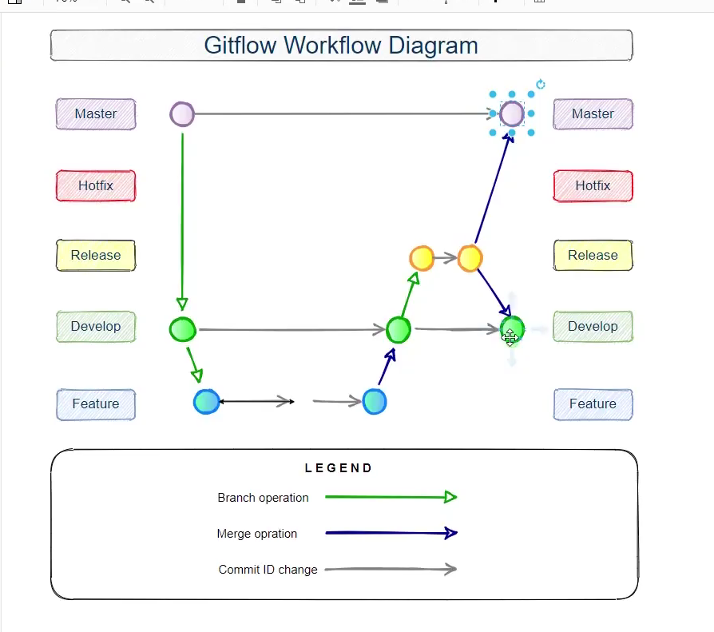

# gitflow

其实就是将一些GitHub操作进行封装，通过gitflow操作GitHub有点类似于一个最佳实践。

## gitflow常用命令

```bash
# 启动一个gitflow
git flow init 
# 之后按照提示填入对应信息

# 开启一个feature分支
git flow feature start feature-name
# 进行feature开发结束后
git flow feature finish feature-name

# 开启release分支
git flow release start '0.1.0'
# 进行release相关操作
git flow release finish '0.1.0'
```

具体的开发流程可以参考下图



>gitflow实现的是一系列git操作集合，在本地执行完gitflow之后，要用push命令推送到远程仓库。