# 什么是GitHub

类似与百度网盘，不过百度网盘是管理的各种资源，GitHub管理的是各种代码，你可以将你的代码托管到GitHub，那为毛要用GitHub:question:因为GitHub最重要的功能，是版本控制，简单理解，就是你可以给你的代码创建很多个版本:book:，然后通过GitHub访问这些版本。

# GitHub入门

## 创建远程仓库

如果你对GitHub什么了解都没有，先想办法登录上去吧，搜索引擎，直接搜索`github官网`，进不去的话（被墙是基操:facepunch:），搜`gitee官网`（其实就是中国版GitHub）也可以，~~不过最近由于各种原因，gitee管得比较严，可以自行百度查看原因~~，进去之后长这样（教程以GitHub为例，gitee同理）


注册好之后，创建个仓库（repository）

>仓库：就是你远程放代码的地方

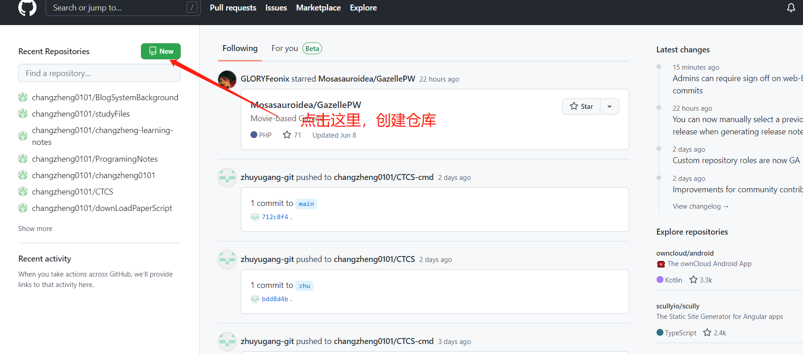

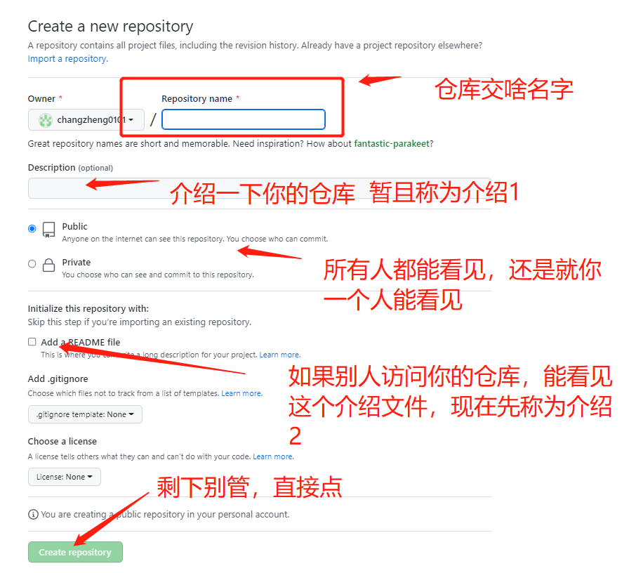

看看我的配置:headphones:

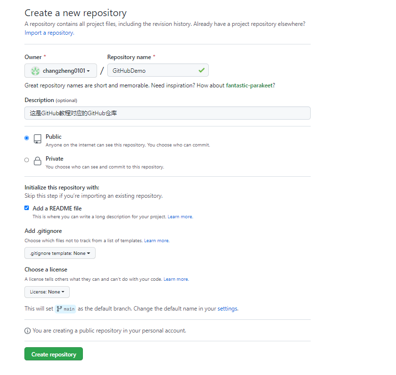

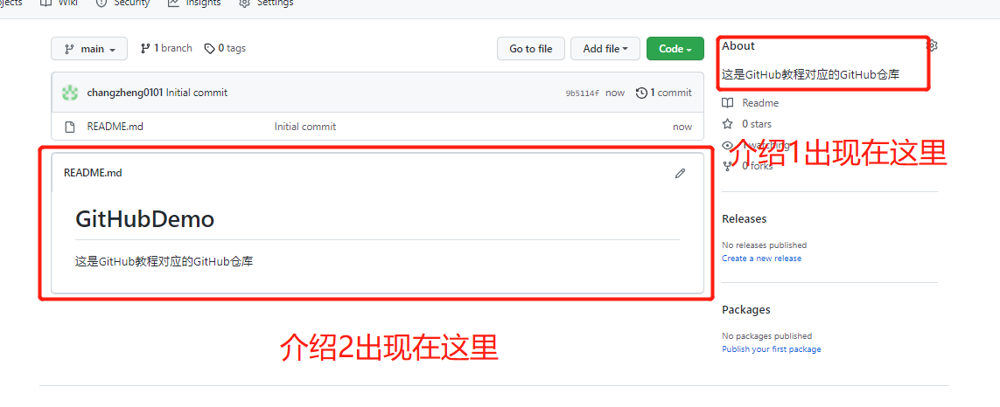

点击一下**README.md**,就可以对介绍2进行更改了~

## 从本地往远处加点文件

### 远端的仓库下载下来

你现在在云端创建了一个仓库，里面有很多文件，现在所有人都可以下载你的文件，**但是对文件的更改权限只属于你**

总不能每天在网页上改文件吧，要知道代码可是在自己电脑上写的。

所以你肯定想，可以在本地更改，然后云端，还能和你进行同步。

首先，将远程的仓库在本地创建一个副本，这个过程类似于，百度网盘里有个文件，你把这个文件下载到你的电脑。

现在本地装一个GitHub环境，可以参考网上的教程。

在GitHub如何操作呢:label:?

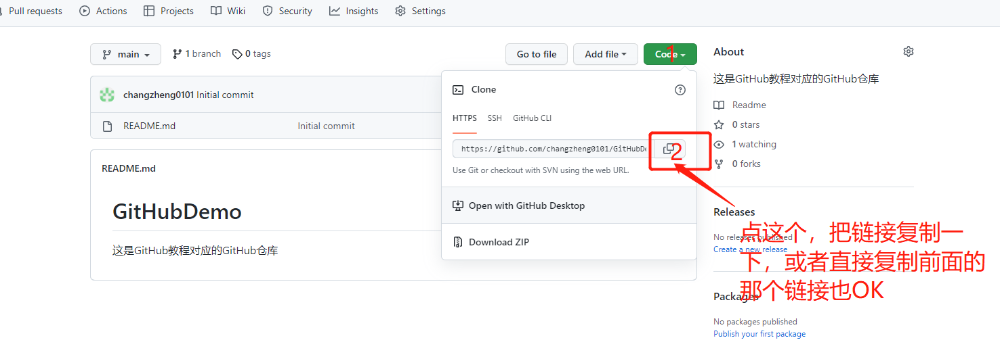

随便找个地方，右键

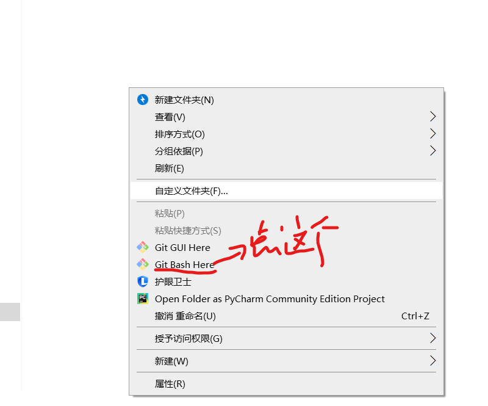

输入如下命令

```bash
git clone 你刚刚复制的连接
```

例如我的就是

```bash
git clone https://github.com/changzheng0101/GitHubDemo.git
```

中途可能因为网络原因下载不下来，可以多试几次或者换gitee，当然有梯子最好了~

正常运行结果

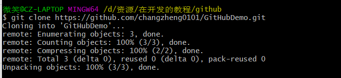

遇见这个：

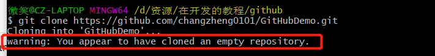

原因：反应有点迟钝，警告你这个空仓库，其实里面有个README.md，直接删除了GitHubDemo（你可能有你自己的文件名字，和远端仓库对应），然后重新clone就解决了。

遇见这个：

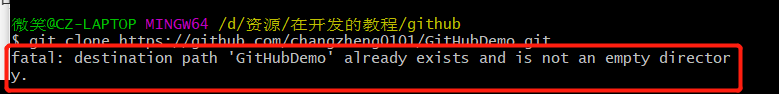

原因 :hamburger: 1. 你在这个`D:\资源\在开发的教程\github`(上面黄字)目录下已经有一个GitHubDemo文件夹了，是你以前不知道什么原因创建的，解决办法，你换了路径重新clone就行

2. 你已经clone过了，多敲了几遍，没啥影响

点进去GitHubDemo文件夹，可以看到文件和GitHub上一样，网盘上的东西下载到本地了，但是多了个`.git`,这个文件夹其实标记了某一个文件夹是不是Git仓库，有git文件夹，就是个git仓库，没有就不是。

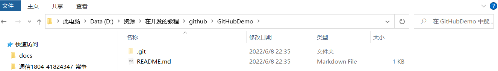

没看见`.git`:first_quarter_moon_with_face:?尝试下面操作

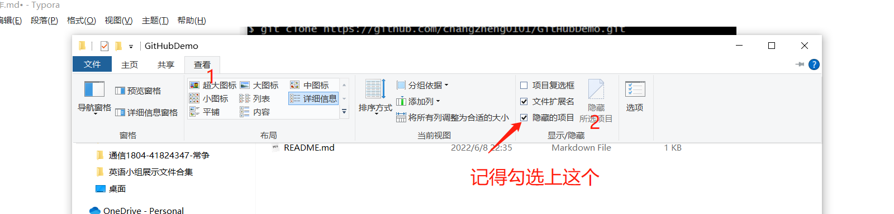

### 本地改点东西

目标：加个文件，`test.txt`,里面写上`爷的第一次提交`，推送到GitHub

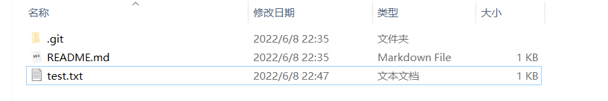

加完收工，那要怎么提交到GitHub呢？**在git的命令行运行这几个**（别管为啥，先敲，先熟悉，后面慢慢都会讲解）

```bash
git add .
git commit -m "add test.txt"
git push
```

结果：

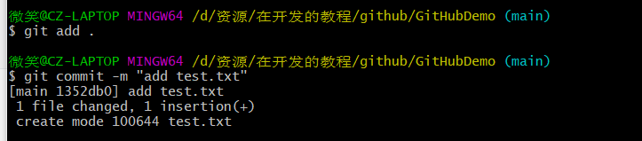、

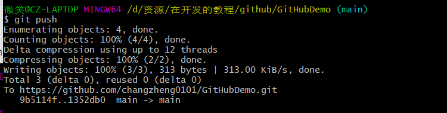

遇见这个：

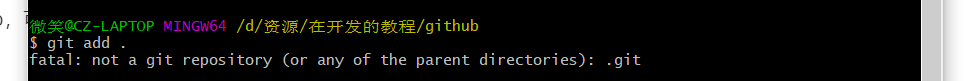

>原因：提示说这不是一个GitHub仓库，因为你现在对应的路径不是一个GitHub仓库，看黄色的字，你现在不在你的GitHub仓库里，解决办法就是进入对应的仓库（其实就是个文件夹），`cd GitHubDemo`(这是linux基本命令)

遇见这个：

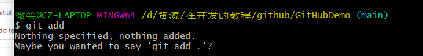

>命令没敲对，`git add .` 最后有个`.`，别忘记了

上网站看看结果上来没，如果没看见，刷新下页面。

你刚刚运行那几条命令的结果应该和我相同，如果有报错，远端肯定看不到，网络之类问题直接更换gitee进行这套操作就行。

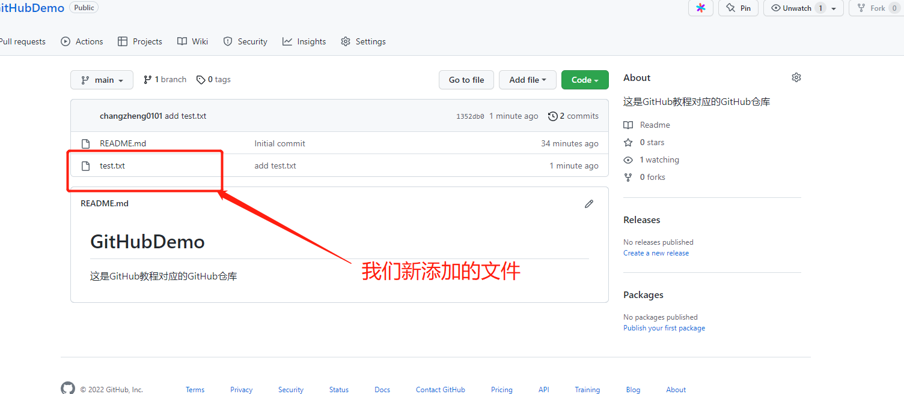

现在，你就可以完成在本地创建文件，然后上传到云端了，GitHub可以被你当百度网盘使了，但是注意**GitHub不能上传太大的文件**，毕竟这个网站是让你托管代码的，可不是托管视频的。