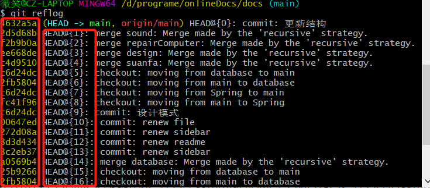

# 重写历史

>不要修改已经push到公共仓库的历史

## git reset

一共有三种模式:`--hard`、`--mixed`(默认，可不写)、`--soft`

```bash
# --hard 同时删除本地内容和缓存区内容
git reset --hard HEAD~1
# --mixed 删除缓存区，但是不删除本地内容
git reset --mixed HEAD~1
git reset HEAD~1
# --soft 仅仅删除commit信息，不删除本地和缓存区内容
git reset --soft HEAD~1
```

HEAD代表对当前commit进行工作，HEAD~1则代表要往前移动一个commit，也就是删除一个commit。

例如：先执行`git reset --soft HEAD~1`，这步操作会取消掉当前的commit，如果是`git reset --soft HEAD`，则当前的commit信息会保存 ，相当于对仓库没什么影响。

`git reset HEAD`会删除暂存区对应的内容，不会删除commit

`git reset --hard HEAD`会删除本地和暂存区的内容，不会删除commit

只有`HEAD~1`才会删除一个commit信息，HEAD往前走一个commit。

## git revert

>revert就是通过添加新的commit来撤销之前的commit，例如你之前增加了一行代码，revert就会删除一行代码，一般应用在为了消除已经push到远程仓库commit的情况（不能直接对远程仓库的commit进行修改）。

```bash
# 重写现在的历史
git revert HEAD
# 重写倒数第二个提交(只重写一个)
git revert HEAD~1
# 重写倒数三个提交,不包括HEAD~3指向的提交，但是包括HEAD
git revert HEAD~3..HEAD
```

将多个commit在一次commit中完成revert

```bash
# 将三次commit需要revert的结果放到暂存区
git revert --no-commit HAED~3..HEAD
# 提交commit完成revert
git revert --continue
# 终止该操作
git revert --abort
```

## git reflog

该命令可以查看所有的提交历史



若想退回某一个历史，可以使用黄色部分或后面红圈的内容

```bash
git reset --hard HEAD@{1}/commitId
```

## 重写commit

>rebase命令会导致大量的commit重新构建，这种操作一般只在本地仓库进行，不要对远程已经提交的仓库进行这种操作。

如果想要重写最近的一次commit，但是不创建新的commit。

```bash
git commit --amend
```

重写历史中的某一次commit，例如在某次commit中添加新文件，之后的所有commit都会有这个添加的新文件。

```bash
git rebase -i commitId
# 之后可以在弹出的对话框中进行修改
git add .
git commit --amend
# 进行这步操作之后代表进行rebase
git rebase --continue
# 终止rebase
git rebase --abort
```

>git show commitId ------------ 可以查看某次commit的内容

删除历史记录中的某次commit

```bash
# rebase到要删除的commit之前
git rebase -i delCommitId^
# 在弹出的窗口中删除想要删除的commit
# 出现冲突用下面的命令解决冲突
git mergetool
git rebase --continue
```

更改commit信息

```bash
git rebase -i changeCommitId^
# 在弹出的窗口中输入reword
# 查看修改结果
git log --oneline
```

将其中的一次commit分成两个commit

```bash
git rebase -i changeCommitId^
# 将想要修改的commit前面的单词改为edit
git reset HEAD^
git add one.txt
git commit -m "first message"
git add two.txt
git commit -m "second message"
git rebase --continue
```

