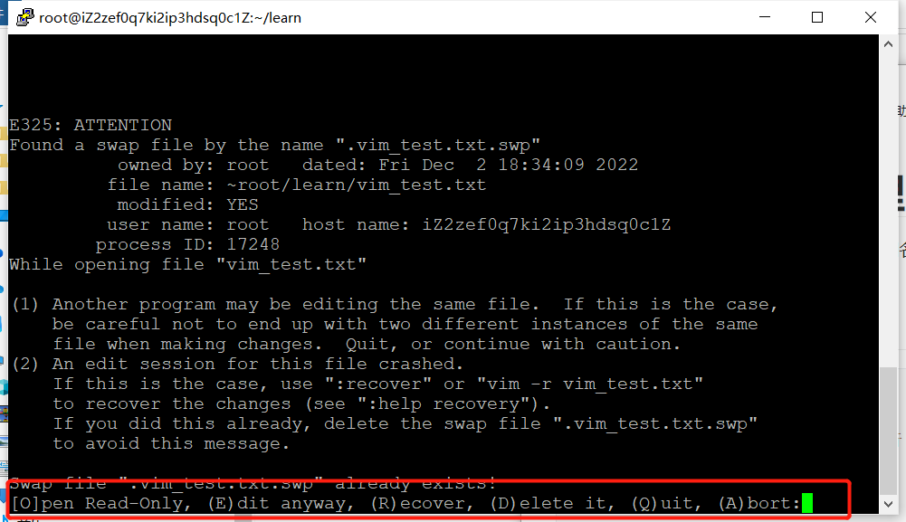

# swap文件如何处理

在进行文件写入时，会在相同目录下创建同名的`.swp`隐藏文件，该文件用于当vim意外终止的时候恢复相关的文件。

## 复现场景

```bash
vim vim_test.txt

# 此时按下Crtl+Z 程序会自动进入后台执行
# 查看所有文件
ls -al

# 杀死vim的后台进程，模仿vim意外终止
kill -9 %1
```

## 修复

此时再运行`vim vim_test.txt`会出现如下的界面。



可以用`O`以只读的方式打开

按下d可以删除，只能恢复到写入之前的状态。

R可以恢复（不过好像没啥用）