# vim基础入门

vim是一款文本编辑器，vim是一个很被程序员看好的编辑工具，同时也是公认的学习难度十分陡峭的一款工具，开头学习的难度比较大，因为这款工具和我们以往对于文本编辑器的认知不同，刚开始一定会学习很慢，但是不要放弃，只要经过了前期陡峭的学习曲线，你一定能体会到vim的威力！

## 安装vim

vim一般在linux系统上容易使用，直接输入vim，如果未跳入如下类似窗口，代表未安装，可以输入如下命令安装。应该跳入的窗口截图(你的窗口可能和我不同，不过大同小异):

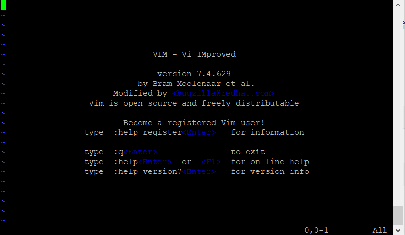

`ubuntu`

```bash
apt install vim
```

centos

```
yum install vim
```

## 使用vim进行简单的编辑

### 先退出这个窗口

这时你肯定面临两个问题

1. 为啥这破窗口好像无法输入
2. 这玩意怎么退出啊

要想退出，要先切换到`底部命令行模式`，如果你进来之后什么也没动，现在所属的模式叫做`命令模式`，进入底部命令行模式需要输入键盘上的`:`，之后会在底部看到

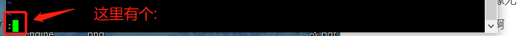

之后输入`q`，按下`enter`，就可以退出当前窗口（q对应quit，代表退出）

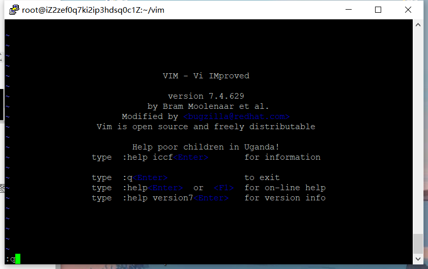

如果按下`:`之后，并没有进入底部命令行模式。检测你现在底部是否有如下类似的东西，正确的视图往往应该是这里空着，什么也没有，这种情况下先按`crtl+c`，之后再按`:`,就可以进入`底部命令行模式了`

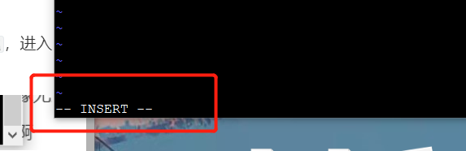

如果输入之后遇到`E37`报错，使用`q!`来退出vim（q!代表强制退出，不保存）

报错：

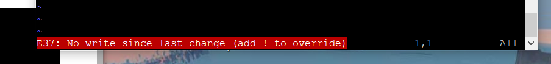

退出方式：

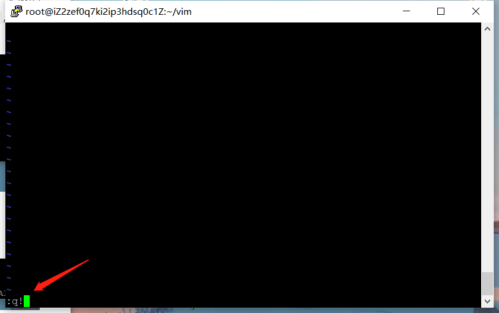

### 写个文件试试

现在先拿一个txt文件练手，如果程序里没有，可以使用如下命令自己生成一个txt文件。

```bash
# 将ls -l的结果输入到test.txt中
ls -l > test.txt
```

用vim编辑这个test.txt

```bash
vim test.txt
```

进入如下的界面，里面内容可能不同，只要有点文件就行

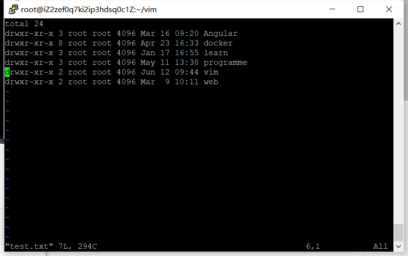

文件编辑器的最简单需求当然是写入点东西，之后再保存退出。

首先，进入输入模式，按下键盘上的`i`，这时候和普通的文本编辑器就一样了

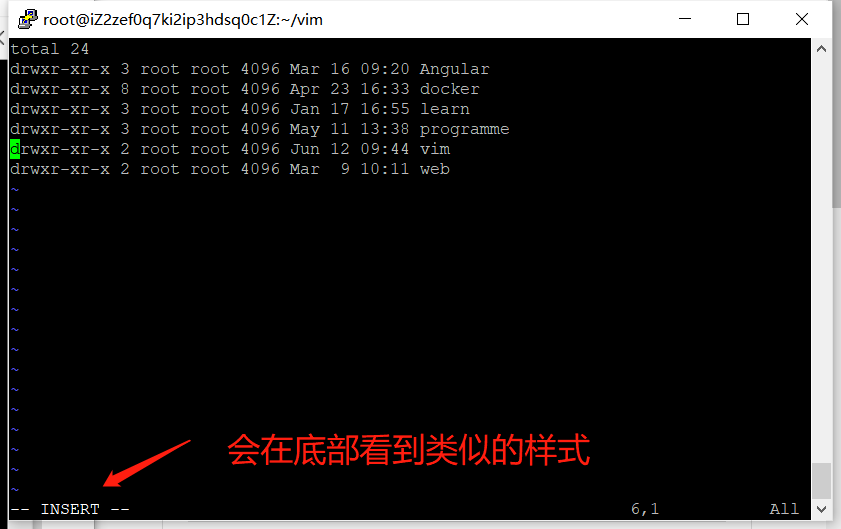

尝试输入`hello world`

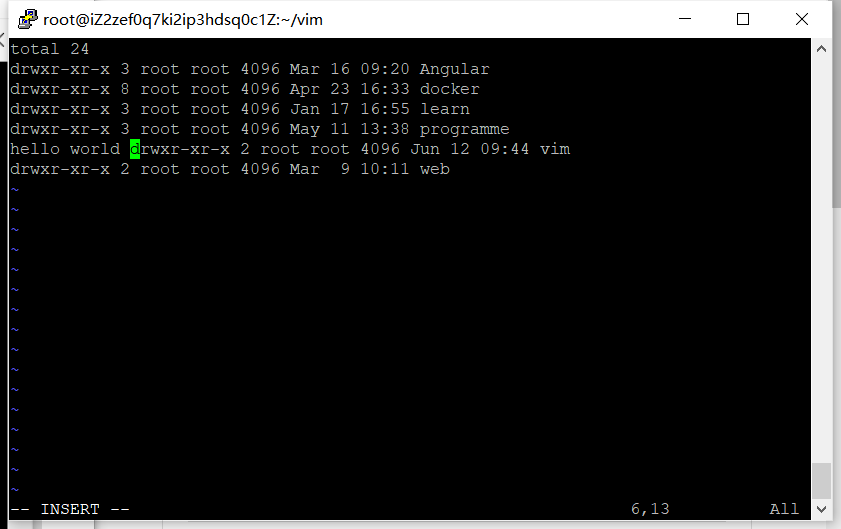

输入`crtl+c`或者`esc`，推荐`crtl+c`，因为`crtl+c`手指更容易按，`esc`还得跑到左上角。

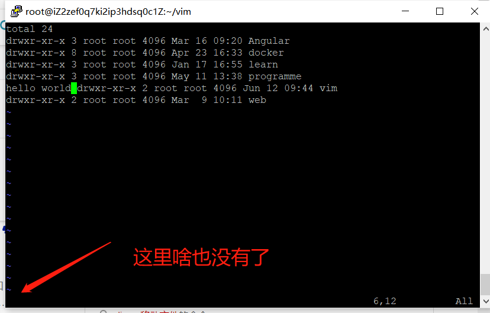

再和刚刚退出的方式一样，先输入`:`，再输入`q`

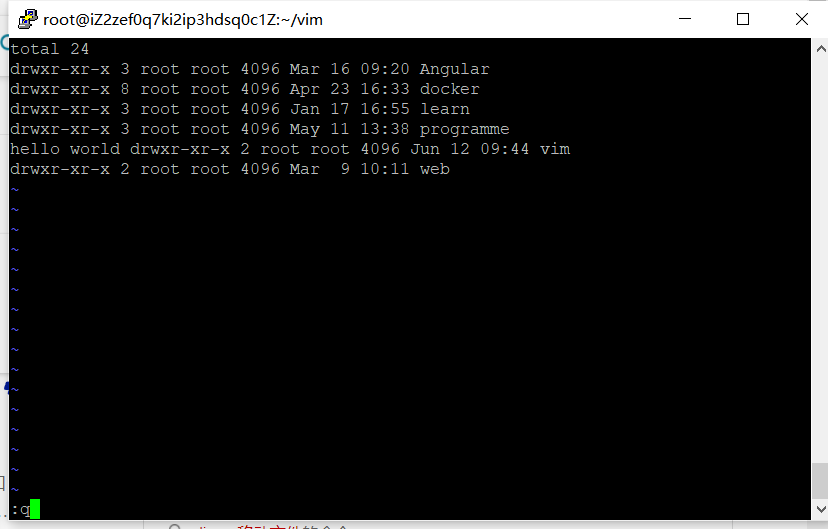

按下`enter`当然会报错了~

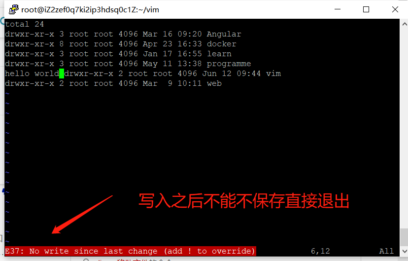

这时候有两种选择

第一种，`直接强制退出，不保存`，和刚刚流程一样,先`:`进入底部命令行模式，之后输入`q!`。

第二种，`写入内容，保存后退出`,先`:`进入底部命令行模式，之后输入`wq`，w代表write，写入之后quit退出。

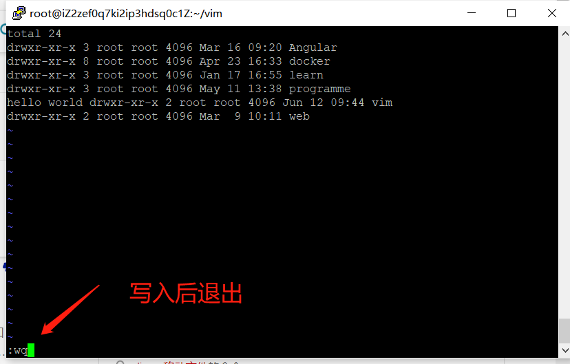

## 总结

* 按下`:`，可以进入底部命令行模式
* 按下`i`，可以进入输入模式，让你和普通文本器一样正常编辑
* 想要退出某个模式，按下`crtl+c`或者`esc`，最终会进入`命令模式`
* `q`代表退出当前编辑，只能退出没修改过的
* `q!`强制退出当前编辑器
* `wq`对文件写入后退出

## 中文文档

安装vimcdoc

## 小练习

创建一个hello.txt，对其进行写入

```bash
vim hello.txt
# 对hello.txt文件编辑 在里面插入hello world
# 对文件进行写入保存
```

