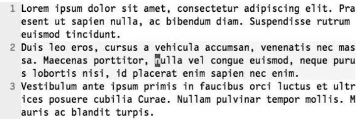

# 基本移动 

h、j、k、l是基本的移动

$移动到行尾，0移动到行首

如果，有9个屏幕行，但是只有 3个实际行，上面的这些操作默认都是 对实际行进行操作，要想对屏幕行进行操作，则需要变成`gx`，例如：`gk`代表在屏幕行内向上移动一行。

## 单词移动

| 按键 | 移动                |
| ---- | ------------------- |
| w    | 下一个单词开头      |
| b    | 上一个单词开头      |
| e    | 目前/下一个单词结尾 |
| ge   | e的反向移动         |
| W    | 下一个字符串的开头  |

>w和W的区别在于 ，w移动的时候，会移动到小括号 、引号等位置，而W是按照字符串进行移动。

# 一个屏幕内移动

想要在一个屏幕内移动

- H - `Head` 移动到屏幕的顶端
- M - `Middle` 移动到屏幕的中间
- L - `Low` 移动到屏幕的底部
- `f  + x ` 向后查找
  - 查找之后 `;`代表下一个位置，`,`代表 上一个位置
- `F +x `  向前查找

# 一个文档内移动

* `{ ` 往上移动一段
* `}`往下移动一段
* 可以和`count`搭配使用
* `%`  在{}、()等配对的东西之间跳跃
* `]m` or `[m` 下一个函数 or 上一个函数开头 M代表函数结尾
* `crtl+e`下一行 `crtl+y` 上一行
* `crtl+d` 下一页 `crtl+u` 上一页

# 全局查找

- `/oeasy\c` 不区分大小写的 `oeasy`
- `/oeasy\C` 区分大小写的 `oeasy`
- 以she开头 `/^she`
- 以she结尾 `/she$`
- `:g/^$/d` 删除所有空行
- `c.m` 点代表任意一个字符
- 反斜杠可以进行转义
- `\s`代表空格和Tab
- `[a-z]*`任意多个小写字母  *代表前面的出现0或者任意多次
- `?`0或者1个字符
- `+`代表一个或者任意多个字符
- `\<` 意味着单词开头
- `\>` 意味着单词结尾
- `n`下一个 `N`上一个