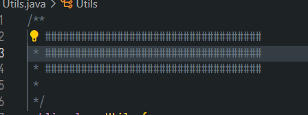
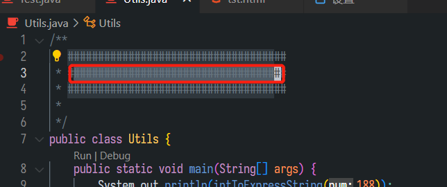
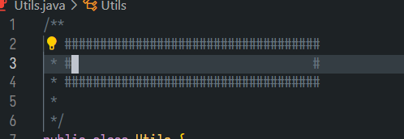
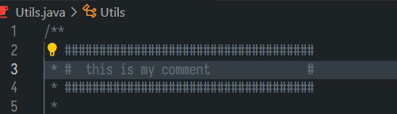

# 选取

* 按下v,然后移动光标就可以选取
* `crtl+v` 矩形选取
* `shift+v`选取整行

# 删除相关

* `x `删除一个字符 
* `X`相当于回车
* `dd`删除一行
* `d+{motion}`
  * `dG` 代表从当前位置删除到行尾
  * `dgg`代表从当前位置删除到开头
  * `motion`代表删除到哪里
  * `w`删除一个单词
  * `b`向前删除一个单词 
  * 可以和方向键配合使用
* `D`删除到行尾，相当于`d$`

# 粘贴相关

* `:reg` 产看寄存器中的内容
  * `^J`代表换行符
* `p`光标后粘贴寄存器内容
* `P`光标前粘贴寄存器内容
* `y`相当于复制粘贴操作
* `d`其实也相当于一个剪切操作

# 替换相关

* 输入 `r` 并且输入 b，a对应的字符被 b 字符替换
* `R`进入replace模式 可以输入然后改变所有的
* `cc`替换整行
* `cw`替换一个单词
* `C`替换到行尾

## 改变

* `~`可以改变大小写
* `>>` `<<` 缩进
  * set shiftwidth控制tab的长度
* 命令模式下
  * `:ce` 居中
  * `:ri`靠右
  * `:le`靠左

# 文本对象

*  i 和 a  代表in 和 around
* `vi{`代表选中大括号中的内容（不包括大括号）
* `va{`代表选中大括号中的内容（包括大括号）
  * v代表visual模式
  * i和a代表选取规则
  * `{}`、`"`等代表选取的区域
  * `vit`可以对tag中的内容进行选中  
    * \<h1\>hello world\</h1\>
    * 会选中hello world

# 块状注释书写

首先输入如图所示的代码块

用v选中下面的内容，用r+space全部替换为空格。

之后再按R，这种replace模式  最后的#不会往后动。