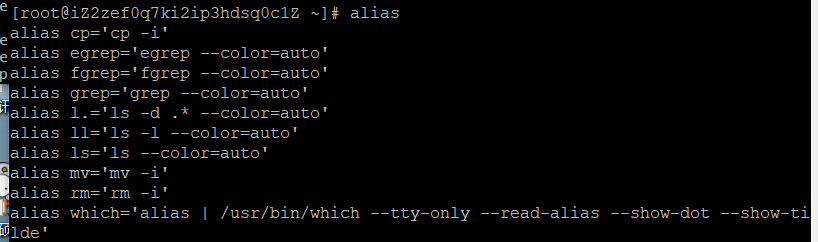
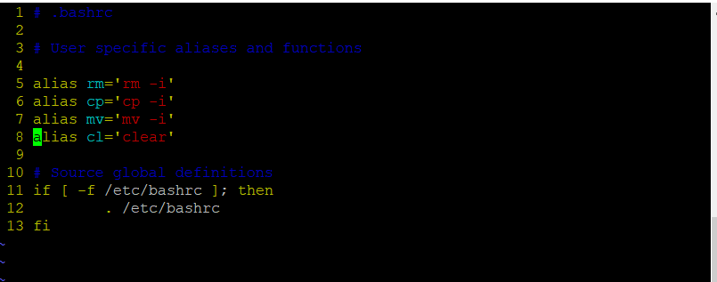

# 别名

有些命令太长，不想全部输入，可以给这个长命令起一个别名。一般用于给命令添加默认参数。

## 查看别名

想要看ls是什么的别名

可以看到`ls`其实代表`ls --color=auto`

如果想要查看所有别名，直接输入`alias`

## 设置别名

`alias 别名 = '要设置的命令'`

例如：`alias ls='ls --color=auto'`

>注意等号两边不能有空格

## 删除别名

`unalias 别名`

例如：`unalias ls`

## 永久设置别名

用`alias`命令设置的别名都是在本次连接中有效，下次再连接上就没了。所以想要永久有效，就要修改`~/.bashrc`文件。

更改完之后需要执行`source ~/.bashrc` 来让修改生效。

例如让`cl`成为`clear`的别名。添加了第八行。

