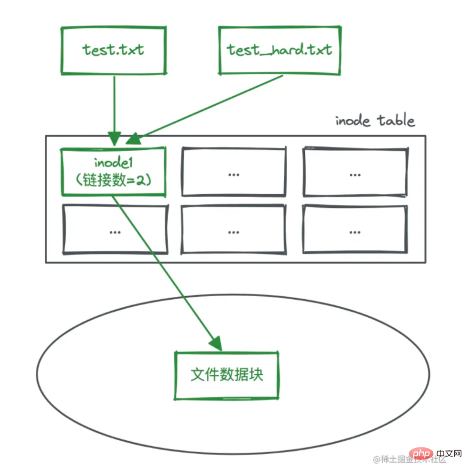
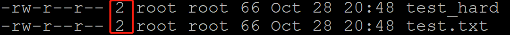
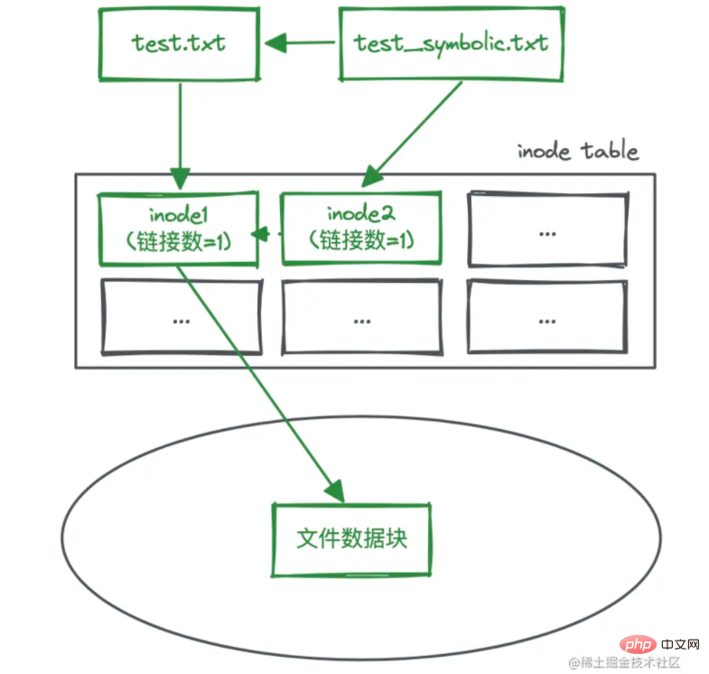

# 软连接和硬链接

linux一切皆文件，对于文件数据的访问，首先要访问inode，之后通过inode访问对应的数据。

>使用`ls -li`其中`i`参数就代表显示inode对应的参数，会显示在第一个。

## 硬链接



查看文件的硬链接数量`ls -l`



```bash
# 创建硬链接 从test.txt 创建 test_hard
ln test.txt test_hard
```

之后对`test_hard`的所有操作等效于对`test.txt`进行操作。二者对应的inode数值相同。

```bash
# 删除某一个
rm test.txt
```

删除test.txt之后 ，test_hard对应的硬链接数目变为1，之后test_hard还可以对对应的文件操作。

## 软连接



```bash
# 创建软连接 -s参数
ln -s test.txt test_soft
```

软连接是一个快捷键方式，如果删除了`test.txt`这个软连接就没用了，类似于快捷方式对应的软件删了，当然访问不到了。

## 二者对比


## 逻辑

1. 前期
   * 查阅资料
   * 问卷发放
   * 分析报告
2. 采访
   * 联系了哪些牛逼的人
     * 人数
     * 录制音频
     * 采访记录

3. 宣传推广

4. 软件

5. 非遗+非遗

6. 媒体报道

7. 论文

8. 实践基地

   >能打的点： 1.抖音平台视频播放量破百万       2. 公众号阅读量突破10w，点赞在看2k
   >
   >3.制作非遗主题书籍：《如果非遗有声音》 4.走出国门，影响世界 5.发表的重点论文
   >
   >6.采访的牛逼人，适当介绍

## 四川队

* 前期
  * 查阅浏览《四川通志》、《导江县志》、《史记》等相关史书约20万字
  * 问卷发放（396份+11168字数据分析）
* 采访
  * 联系人，进行采访（7人，录制采访音频462分钟，撰写采访记录4万余字）
* 宣传推广 （不同的地方宣讲，**走出国门**）
  * 6个视频
  * 公众号：35篇推送，7000+浏览量，960点赞（被银杏树下、材苑拾贝、冶金青年等多个官方公众号转发）
  * 微博、微信、小红书：1w
  * 成都市新津区实验高级中学，对四川非遗民间文学进行了宣传。
  * 知识问答，共答题397次。
  * 讲解音频8条
* 特色产品（非遗plus非遗）
  * 卓文君和司马相如主题糖画
  * 《文君听琴》双面异形绣
  * 四川省文化旅游导览地图并撰写2000字攻略
  * 制作包含15个故事的四川非遗文学故事绘本，全文9000余字
* 论文
  * 三篇高质量论文，共15023字
* 软件相关
  * 将非遗民间文学以游戏为载体传播，截至目前，试玩人数已突破200
  * 制作实践团小程序，增设宣传平台
  * 表情包+文创
* 媒体宣传
  * 被中讯网、中国网、四川成都网、四川资讯网、四川新闻网、中国资讯网、大学生家园网等一百一十个网站首页报道
  * 四川成都非遗官方公众号推送报道
* 实践基地

## 山西队伍

* 前期
  * 查阅近十余本史料 ，二十余万字阅读量
  * 有效问卷1012份，数据分析8174字

* 采访

  * 音频135分钟
  * 采访记录7k字

* 宣传推广

  * 8条视频，观看量3.3万次，获赞41次；
  * 近二十篇公众号文章，浏览量4191次，点赞共计320次，在看238次；
  * 6个抖音视频，播放量达1100次；
  * 4篇小红书笔记，总计272次阅读量
  * 音频8条，收听403人

  * 学而思课程1323人
  * 支教宣讲活动

* 特色产品（非遗+ 非遗）

  * 稷山县稷王庙四幅农事木雕图，生动再现几千年前稷山稼穑情景
  * 剪纸
  * 面塑
  * 钥匙扣+ 口罩
  * 漫画 10+ ， 表情包两套

* 软件相关

  * 试玩人数达340人，点赞数初步已达66人

* 论文

  * 撰写论文两篇，总近万字

* 媒体报道

  * 14家媒体

* 实践基地

## 浙江队伍

* 前期
  * 593份问卷
  * 问卷分析xxx
* 采访
  * 采访5位非遗传承人、采访三位非遗技艺传承人、采访三位非遗办负责人、采访浙大教授
  * 视频十六个哦
  * 访谈记录共六万
  * **制作非遗主题书籍：《如果非遗有声音》**
* 宣传推广
  * 线下学校宣传宣讲，三个幼儿园，三个线上学校
  * 在抖音、快手、腾讯视频、b站、小红书、微博等自媒体平台宣传实践过程与成果，其中**抖音平台视频获得54.2万播放量**
  * **实践团出精品推送40篇，总阅读量12409，点赞、在看数均破两千**，推送被材子风华、材苑拾贝转载
* 特色产品（非遗+ 非遗）
  * 没有嘛？
* 软件相关
  * 表情包+文创产品
  * 答题闯关小程序
* 论文
  *   参与“我看故乡这十年”征文活动，投稿浙江非遗期刊杂志（即将刊登）。
* 媒体报道
  * 十八家媒体报道

* 实践基地