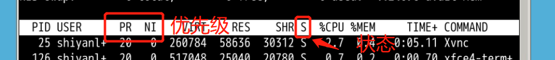

# 基本概念

> **并发：**在一个时间段内，宏观来看有多个程序都在活动，有条不紊的执行（每一瞬间只有一个在执行，只是在一段时间有多个程序都执行过）

> **并行：**在每一个瞬间，都有多个程序都在同时执行，这个必须有多个 CPU 才行
>
> **线程**（thread）是操作系统能够进行运算调度的最小单位。它被包含在进程之中，是进程中的实际运作单位。一条线程指的是进程中一个单一顺序的控制流，一个进程中可以并发多个线程，每条线程并行执行不同的任务。因为线程中几乎不包含系统资源，所以执行更快、更有效率。
>
> **守护进程**：守护进程是一直运行的一种进程，在 Linux 系统启动时启动，在系统关闭时终止。它们独立于控制终端并且周期性的执行某种任务或等待处理某些发生的事件。例如 httpd 进程，一直处于运行状态，等待用户的访问。还有经常用的 cron（在 centOS 系列为 crond）进程，这个进程为 crontab 的守护进程，可以周期性的执行用户设定的某些任务。
>
> **僵尸进程**：在将要结束时的子进程代码执行部分已经结束执行了，系统的资源也基本归还给系统了，但若是其进程的进程控制块（PCB）仍驻留在内存中，而它的 PCB 还在，代表这个进程还存在（因为 PCB 就是进程存在的唯一标志，里面有 PID 等消息），并没有消亡，这样的进程称之为僵尸进程（Zombie）
>
> **孤儿进程**：另外如果父进程结束（非正常的结束），未能及时收回子进程，子进程仍在运行，这样的子进程称之为孤儿进程。在 Linux 系统中，孤儿进程一般会被 init 进程所“收养”，成为 init 的子进程。由 init 来做善后处理，所以它并不至于像僵尸进程那样无人问津，不管不顾，大量存在会有危害。
>
> init为所有进程的父进程

# 查看进程

```bash
# 查看当前系统中的所有进程
pstree

# 动态查看
top
# q 退出程序 P 根据CPU占用大小排序

# 静态查看
ps
# 自定义
ps -afxo user,ppid,pid,pgid,command
# 只查看和自己有关的
ps -l
```



# 后台执行

```bash
# 通过&让程序在后台执行
ls &

tail -f /var/log/dpkg.log

# `crtl+z` 放到后台执行

# 查看后台任务
jobs 

# 将后台任务掉到前台
fg

# 改变后台任务状态 例如从suspend变为running
# 到了后台后都是suspend 运行这个命令才能继续运行
bg

# 杀死某个job
# 杀死第三个job
kill -p %3
```

# 查看机器

```bash
#查看物理CPU的个数
#cat /proc/cpuinfo |grep "physical id"|sort |uniq|wc -l

#每个cpu的核心数
cat /proc/cpuinfo |grep "physical id"|grep "0"|wc -l
```

# 进程相关命令

## ps

* 列出所有程序
* 和grep结合使用可以找进程

## top

* top -o %MEM 按照mem的大小来进行排序显示

## kill

* kill -l 列出可以发送的信号
* 15 温和的杀死程序方式
* 9 直接中断程序的执行
* kill -9 PID
* kill -KILL PID
* 默认是15

## killall

* 杀死所有进程
* killall -9 node 杀死所有node
* 不是精确匹配

## jobs

* 查看所有停止的进程
* 用crtl 加z 进行停止
* fg/bg 加程序id让其重新运行
  * foreground -- background

