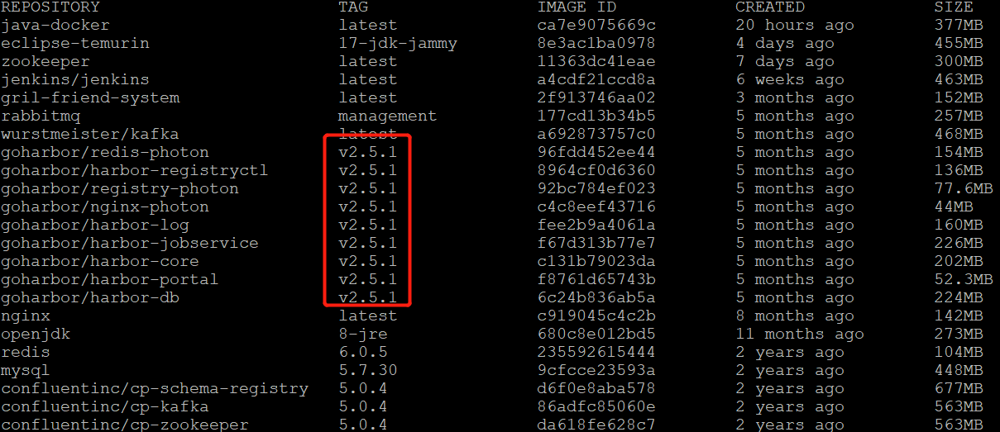
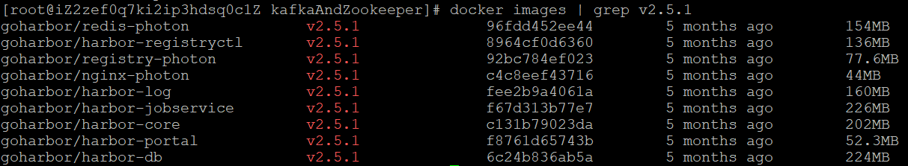
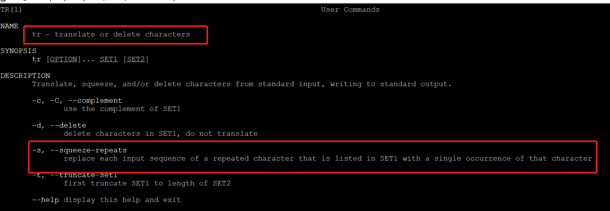
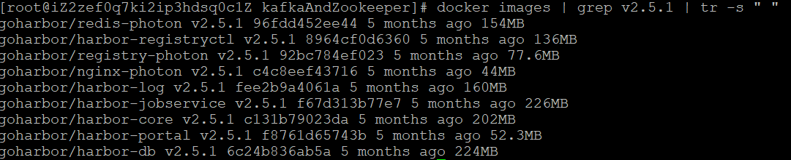
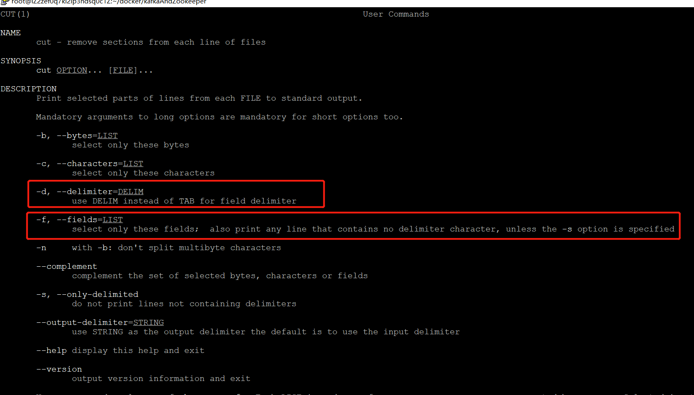
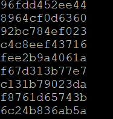

# docker命令

## 基本命令--命令式

```bash
# docker 信息
docker info

# 查看在运行的进程
docker ps

#  查看容器信息
docker inspect container_name

# 查看log
docker logs container_name 
# -f 持续追踪 
# -t 显示时间戳

# 查看容器中的进程
docker top container_name

# 相对于镜像，容器做了哪些改变
docker diff container_name

# 删除所有停止的容器
docker container prune -f
```

>可以使用`--help`查看可以附加的命令

## docker run

- `-i` 或 `--interactive`， 交互模式。
- `-t` 或 `--tty`， 分配一个 `pseudo-TTY`，即伪终端。
- `-d` 或 `--detach`，在后台运行容器并输出容器的 `ID` 到终端。
- `--rm` 在容器退出后自动移除。
- `-p` 将容器的端口映射到主机。
- `-v` 或 `--volume`， 指定数据卷。


- `--name` 指定一个容器名称，未指定时，会随机产生一个名字
- `--hostname` 设置容器的主机名
- `--mac-address` 设置 `MAC` 地址
- `--ulimit` 设置 `ulimit` 选项，限制容器的资源
-  `--restart=always` 选项保证容器始终不关闭

```bash
docker run -d \
    --name shiyanlou01 \
    --hostname shiyanlou01 \
    --mac-address 00:01:02:03:04:05 \
    --ulimit nproc=1024:2048 \
    -it ubuntu /bin/bash
```

>跑起来的容器如果未使用`-d`参数进入了交互模式，可以通过先按`crtl+p`再按`crtl+q`让其进入后台运行 。

## docker ps

* -a 查看所有容器
* -q 只查看容器的ID
* -s 查看容器的大小

## 批量删除镜像

如果想要删除共同拥有某一个`标签/前缀`的镜像

首先获取镜像`docker images`，例如要删除这里的`v2.5.1`对应的镜像



把对应`v2.5.1`的内容拿出来

`docker images | grep v2.5.1`



如果要删除，需要获取对应的容器ID，思路是先分割，之后再选择第三个

第一个要使用的命令 `tr -s " "`

具体意思使用`man tr`查看



翻译过来：-s参数可以把一连串连续的相同字符变为一个

假如输入是`xxxxx` ------经过`tr -s "x"`之后输出就为"x"。

这里我们替换掉空格`docker images |grep v2.5.1 | tr -s " "`



之后我们要将每行字符用空格分隔，获取第三个。这里我们使用`cut`命令，用`man cut`查看用法



翻译一下：`-d`参数可以改变分隔符，`-f`参数决定分隔之后选择第几个，这个命令是一行一行操作的，我们要用空格分隔，选取容器ID，也就是第三个参数。

`docker images | grep v2.5.1 | tr -s " " | cut -d " " -f 3`



获得容器ID之后只需要将这些作为`docker rmi`命令的参数传入即可。

**最终命令**：

`docker rmi -f $(docker images | grep v2.5.1 | tr -s " " | cut -d " " -f 3)`

## 删除stop的所有镜像

`docker system prune`

>This will remove:
>  - all stopped containers
>  - all networks not used by at least one container
>  - all dangling images
>  - all dangling build cache

## 查看log

`docker logs containerID -f`

`-f`代表持续查看，也可不加

`-t`代表显示时间戳

## 根据已经运行的容器创建镜像

在运行一个容器之后，可能进去与之交互，完成了某些修改，如果下次想直接镜像运行之后就是当前容器，需要复刻一个镜像出来。

```bash
docker commit container_name image_name:image_tag
```

>用Dockerfile构建比这个方法好点，这个不推荐在生产系统中使用

## volume

```bash
# 查看volume
docker volume ls

# 创建
docker volume create volume_name
(不指定 volume_name 会生成一串随机名字)
```

## 常用命令--表格

| 命令                                     | 解释                                                         |
| ---------------------------------------- | :----------------------------------------------------------- |
| docker ps -a                             | 查看所有整正在运行的容器                                     |
| docker rmi containerName:tag             | 删除某个镜像（**注意只有镜像的标签是latest的时候，才不用添加标签，否则提示镜像找不到**） |
| docker pull imageName                    | 拉取某个镜像                                                 |
| docker images                            | 查看所有镜像                                                 |
| docker logs -f container                 | 查看某个镜像的log                                            |
| docker exec -it container bash           | 与容器进行交互                                               |
| docker cp file contianer:/contianer/path | 将外界的文件复制到container中                                |

## 删除正在运行的容器

```bash
docker ps -a
# 先停止
docker stop containerId
# 删除容器
docker rm containerId
```

| 命令                           | 解释         |
| ------------------------------ | ------------ |
| docker-compose stop jenkins    | 停止jenkins  |
| docker-compose start jenkins   | 启动jenkins  |
| docker-compose restart jenkins | 重启jenkins  |
| docker-compose down            | 删除整个服务 |