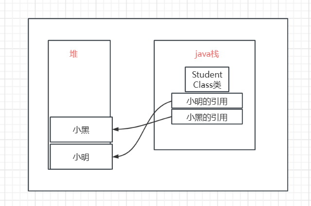

# JVM

JVM运行在操作系统之上，是用C加加写的

## 区域划分

整个JVM可以分为五大区域

* 方法区（Method Area）：被所有线程共享，放static、final、Class模板和常量池
* 堆（Heap）
* java栈（Stack）
* 本地方法栈（Native Method Stack）
* 程序计数器：每个线程有一个

## 类的创建对于JVM意味着什么

假设我们自己创建了一个Student类，Student对应的Class类会保存在Java栈中，在创建小明、小黑这些具体的对象时候，创建出来的对象都保存在堆中，而java栈中只保存对应的引用。

## 双亲委派机制

java为了保证安全而设计的一种机制。

场景：如果我们自己定义一个String类，使用这个类，最后会发现提示找不到main方法，这是因为是**底层的String被调用了，而不是我们的String被调用了**

类加载器主要有三个：

bootstrap Classloader：用于加载%JAVA_HOME%下的lib下的jar包和类

Ext ClassLoader  加载%JAVA_HOME%\lib\ext 目录下的jar包

App ClassLoader 用于加载我们自己写的代码

bootstrap 是Ext的父类，Ext是App的父类。

在用类创建实例的时候，会先用bootstrap Class loader进行加载，不行在用Ext，最后用App，全不行就抛出Class not found。刚刚的例子中，bootstrap中就可以完成String的加载，轮不到App进行加载。

>获取bootstrap Class loader结果为null，因为java底层是用C和C++写的，底层的目标就是消除C++中的指针和手动内存管理。java代码底层有时候会用native进行修饰，这是因为java方法已经无法处理了，用这个关键字可以调用底层的方法。

## Native关键字

native关键字是在调用底层的方法时候才使用，有时调用别的语言写的代码也可以使用，java在底层的时候，有些事情处理不了了，最典型的就是Thread类在start之后会调用`strat0`方法，其实就是调用了底层的C或者C++方法，最开始native关键字就是这一目的，但是后来就可以和别的语言互相调用了，例如想用java和打印机进行交互，就得使用native关键字，其实调用的是JNI（java native interface）本地方法接口。

## 堆（Heap）

一个JVM只有一个堆内存，堆内存的大小是可以进行调节的。

堆内存主要分为三个区域：

* 新生区（伊甸园区） young / new
* 养老区 old
* 永久区 Perm

堆内存爆了之后会报`OutOfMemory`异常

永久存储区在JDK8之后又改名为了元空间。

## 参数

`-Xms8m -Xmx8m -XX:+PrintGCDetails`

解释：初始化内存大小 最大内存大小 打印出GC信息

`-Xms8m -Xmx8m -XX:+HeapDumpOnOutOfMemoryError` // 最后的参数代表在OutOfMemoryError时候Dump一份内存文件

## OOM故障排除

1.扩大堆的大小。

2.如果扩大堆的大小之后仍然报错，就需要进一步分析代码。

* 如果是线上运行的代码，肯定不能直接debug
* 需要dump内存文件进行进一步的分析

## GC

### 整体理解

GC是针对堆来进行操作的，在栈中并不会GC。整个堆主要分为三部分：

* 伊甸园区
* 幸存区（from，to）
* 老年区

GC有两种类型：轻GC和重GC

### GC算法

#### 引用计数法（这个算法一般用来判活）

>--这种方式比较low，现在JVM已经不使用这种方法了，但是在别的语言中比如python还在使用这种算法。--
>
>上面写的不确定，，，那用啥啊，判活比较靠谱

就是每个对象都有一个计数器，用来标记有几个引用指向了这个对象，为0之后就清除对应的对象，但是计数器等会消耗大量的资源。

#### 复制算法（用在新生代）

主要使用在新生代，**适合于存活时间较短的数据**，存活度较低不浪费内存，一会就能被清理掉。

幸存区中分为from和to，**其中那块是空的那块是to区**，from和to是一个相对的概念，并不是一成不变的。

每次GC（轻）的时候就会将伊甸园中还存活的对象移动到to区，同时也将from区中的对象移动到to区，移动完之后，原来的from区就成为了新的to区，伊甸园区在经历一次GC之后也会是空的（对象都被转移了）。

当一个对象经历了15次GC还没有被消灭，就会移动到老年区。

* 好处：没有内存碎片，内存都是连续使用的，不会出现两个内存中间空一点内存这种情况
* 坏处：浪费了一半的内存空间，to区始终都是空的

#### 标记清除压缩算法（用在老年代）

* 好处：不会消耗额外的空间
* 坏处：会产生内存碎片，并且扫描比较浪费时间

 

